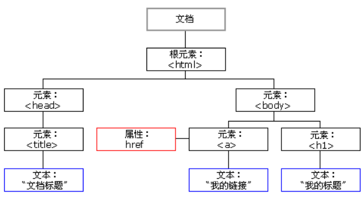
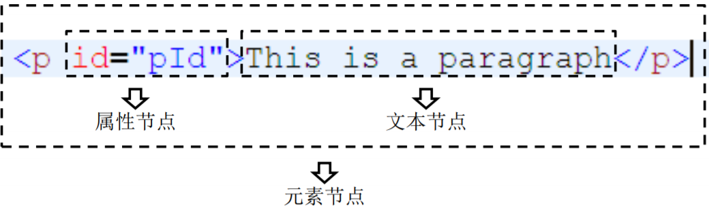
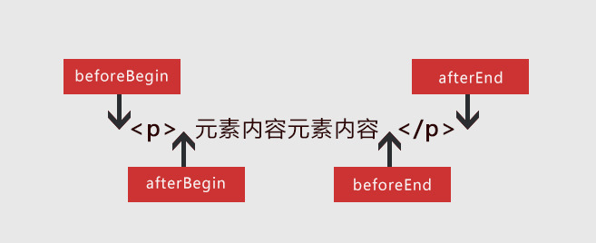

# DOM

当网页被加载时，浏览器会创建页面的文档对象模型（**D**ocument **O**bject **M**odel）。

HTML **DOM** 模型被结构化为 **对象树** ：



HTML DOM 是关于如何获取、更改、添加或删除 HTML 元素的标准

通过这个对象模型

- JavaScript 能改变页面中的所有 HTML 元素
- JavaScript 能改变页面中的所有 HTML 属性
- JavaScript 能改变页面中的所有 CSS 样式

- JavaScript 能删除已有的 HTML 元素和属性
- JavaScript 能添加新的 HTML 元素和属性
- JavaScript 能对页面中所有已有的 HTML 事件作出反应
- JavaScript 能在页面中创建新的 HTML 事件

## DOM文档节点

节点Node，是构成我们网页的最基本的组成部分，网页中的每一个部分都可以称为是一个节点。

节点：Node——构成HTML文档最基本的单元。

常用节点分为四类：

- 文档节点：整个HTML文档
- 元素节点：HTML文档中的HTML标签54444445
- 属性节点：元素的属性
- 文本节点：HTML标签中的文本内容



### 文档节点

**文档节点（Document）**代表的是整个HTML文 档，网页中的所有节点都是它的子节点。

document对象作为window对象的属性存在的，我们不用获取可以直接使用。

通过该对象我们可以在整个文档访问内查找节点对象，并可以通过该对象创建各种节点对象。

### 元素节点

HTML中的各种标签都是元素节点（Element），这也是我们最常用的一个节点。

浏览器会将页面中所有的标签都转换为一个元素节点， 我们可以通过document的方法来获取元素节点。

例如：document.getElementById()，根据id属性值获取一个元素节点对象。

### 属性节点

属性节点（Attribute）表示的是标签中的一个一个的属 性，这里要注意的是属性节点并非是元素节点的子节点，而是元素节点的一部分。可以通过元素节点来获取指定的属性节点。

例如：`元素节点.getAttributeNode("属性名")`，根据元素节点的属性名获取一个属性节点对象。

> 注意：我们一般不使用属性节点。

### 文本节点

文本节点（Text）表示的是HTML标签以外的文本内容，任意非HTML的文本都是文本节点，它包括可以字面解释的纯文本内容。文本节点一般是作为元素节点的子节点存在的。获取文本节点时，一般先要获取元素节点，在通过元素节点获取文本节点。

例如：`元素节点.firstChild;`，获取元素节点的第一个子节点，一般为文本节点。

## DOM文档操作

文档对象代表您的网页,，如果您希望访问 HTML 页面中的任何元素，那么您总是从访问 document 对象开始。

### 查找HTML元素

| 方法                                    | 描述                        |
| --------------------------------------- | --------------------------- |
| document.getElementById(*id*)           | 通过元素 id 来查找元素。    |
| document.getElementsByTagName(*name*)   | 通过标签名来查找元素。      |
| document.getElementsByClassName(*name*) | 通过类名来查找元素。        |
| document.querySelector(*CSS选择器*)     | 通过CSS选择器选择一个元素。 |
| document.querySelectorAll(*CSS选择器*)  | 通过CSS选择器选择多个元素。 |

### 获取 HTML 的值

| 方法                               | 描述                          |
| ---------------------------------- | ----------------------------- |
| 元素节点.innerText                 | 获取 HTML 元素的 inner Text。 |
| 元素节点.innerHTML                 | 获取 HTML 元素的 inner HTML。 |
| 元素节点.属性                      | 获取 HTML 元素的属性值。      |
| 元素节点.getAttribute(*attribute*) | 获取 HTML 元素的属性值。      |
| 元素节点.style.样式                | 获取 HTML 元素的行内样式值。  |


### 改变HTML的值

| 方法                                        | 描述                         |
| ------------------------------------------- | ---------------------------- |
| 元素节点.innerText = *new text content*     | 改变元素的 inner Text。      |
| 元素节点.innerHTML = *new html content*     | 改变元素的 inner HTML。      |
| 元素节点.属性 = *new value*                 | 改变 HTML 元素的属性值。     |
| 元素节点.setAttribute(*attribute*, *value*) | 改变 HTML 元素的属性值。     |
| 元素节点.style.样式 = *new style*           | 改变 HTML 元素的行内样式值。 |

> 注意：如果CSS的样式名中含有-，这种名称在JS中是不合法的比如background-color，需要将这种样式名修改为驼峰命名法，去掉-，然后将-后的字母大写，我们通过style属性设置的样式都是行内样式，同样的获取也是行内样式，而行内样式有较高的优先级，所以通过JS修改的样式往往会立即显示，但是如果在样式中写了!important，则此时样式会有最高的优先级，即使通过JS也不能覆盖该样式，此时将会导致JS修改样式失效，所以尽量不要为样式添加!important

**修改节点的内容除了常用的innerHTML和innerText之外，还有insertAdjacentHTML和insertAdjacentText方法，可以在指定的地方插入内容。insertAdjacentText方法与insertAdjacentHTML方法类似，只不过是插入纯文本，参数相同。**

```javascript
object.insertAdjacentHTML(where,html);
object.insertAdjacentText(where,text)
```

参数说明：

- where：
  - beforeBegin：插入到开始标签的前面
  - beforeEnd：插入到结束标签的前面
  - afterBegin：插入到开始标签的后面
  - afterEnd：插入到结束标签的后面



- html：一段html代码
- text：一段文本值

注意事项：

这两个方法必须等文档加载好后才能执行，否则会出错。
insertAdjacentText只能插入普通文本，insertAdjacentHTML插入html代码。
使用insertAdjacentHTML方法插入script脚本文件时，必须在script元素上定义defer属性。
使用insertAdjacentHTML方法插入html代码后，页面上的元素集合将发生变化。
insertAdjacentHTML方法不适用于单个的空的元素标签(如img，input等)。

### 修改HTML元素

| 方法                                  | 描述                               |
| ------------------------------------- | ---------------------------------- |
| document.createElement(*element*)     | 创建 HTML 元素节点。               |
| document.createAttribute(*attribute*) | 创建 HTML 属性节点。               |
| document.createTextNode(*text*)       | 创建 HTML 文本节点。               |
| 元素节点.removeChild(*element*)       | 删除 HTML 元素。                   |
| 元素节点.appendChild(*element*)       | 添加 HTML 元素。                   |
| 元素节点.replaceChild(*element*)      | 替换 HTML 元素。                   |
| 元素节点.insertBefore(*element*)      | 在指定的子节点前面插入新的子节点。 |

### 查找HTML父子

| 方法                            | 描述                                                         |
| ------------------------------- | ------------------------------------------------------------ |
| 元素节点.parentNode             | 返回元素的父节点。                                           |
| 元素节点.parentElement          | 返回元素的父元素。                                           |
| 元素节点.childNodes             | 返回元素的一个子节点的数组（包含空白文本Text节点）。         |
| 元素节点.children               | 返回元素的一个子元素的集合（不包含空白文本Text节点）。       |
| 元素节点.firstChild             | 返回元素的第一个子节点（包含空白文本Text节点）。             |
| 元素节点.firstElementChild      | 返回元素的第一个子元素（不包含空白文本Text节点）。           |
| 元素节点.lastChild              | 返回元素的最后一个子节点（包含空白文本Text节点）。           |
| 元素节点.lastElementChild       | 返回元素的最后一个子元素（不包含空白文本Text节点）。         |
| 元素节点.previousSibling        | 返回某个元素紧接之前节点（包含空白文本Text节点）。           |
| 元素节点.previousElementSibling | 返回指定元素的前一个兄弟元素（相同节点树层中的前一个元素节点）。 |
| 元素节点.nextSibling            | 返回某个元素紧接之后节点（包含空白文本Text节点）。           |
| 元素节点.nextElementSibling     | 返回指定元素的后一个兄弟元素（相同节点树层中的下一个元素节点）。 |

## DOM文档事件

### 窗口事件

| 属性      | 描述                                                         |
| --------- | ------------------------------------------------------------ |
| onblur    | 当窗口失去焦点时运行脚本。                                   |
| onfocus   | 当窗口获得焦点时运行脚本。                                   |
| onload    | 当文档加载之后运行脚本。                                     |
| onresize  | 当调整窗口大小时运行脚本。                                   |
| onstorage | 当 Web Storage 区域更新时（存储空间中的数据发生变化时）运行脚本。 |

### 表单事件

| 属性      | 描述                           |
| --------- | ------------------------------ |
| onblur    | 当元素失去焦点时运行脚本。     |
| onfocus   | 当元素获得焦点时运行脚本。     |
| onchange  | 当元素改变时运行脚本。         |
| oninput   | 当元素获得用户输入时运行脚本。 |
| oninvalid | 当元素无效时运行脚本。         |
| onselect  | 当选取元素时运行脚本。         |
| onsubmit  | 当提交表单时运行脚本。         |

### 键盘事件

| 属性       | 描述                         |
| ---------- | ---------------------------- |
| onkeydown  | 当按下按键时运行脚本。       |
| onkeyup    | 当松开按键时运行脚本。       |
| onkeypress | 当按下并松开按键时运行脚本。 |

```javascript
<script>
    /* 当键盘按下判断当前的按键是不是 a ，如果是就输出true，否则输出false */
    window.onkeydown = function (event) {
        /* 解决兼容性问题 */
        event = event || window.event;

        if (event.keyCode == 65) {
            console.log("true");
        } else {
            console.log("false");
        }
    };
</script>
```

**拓展知识**：

当事件的响应函数被触发时，浏览器每次都会将一个事件对象作为实参传递进响应函数。

event 对象代表事件的状态，比如事件在其中发生的元素、键盘按键的状态、鼠标的位置、鼠标的状态。

在IE8中，响应函数被触发时，浏览器不会传递事件对象，在IE8及以下的浏览器中，是将事件对象作为window对象的属性保存的。

> 解决事件对象的兼容性问题：event = event || window.event;

**键鼠属性：**

| 属性                                                         | 描述                                         |
| ------------------------------------------------------------ | -------------------------------------------- |
| [ctrlKey](https://www.w3school.com.cn/jsref/event_ctrlkey.asp) | 返回当事件被触发时，“CTRL” 键是否被按下。    |
| [altKey](https://www.w3school.com.cn/jsref/event_altkey.asp) | 返回当事件被触发时，“ALT” 是否被按下。       |
| [shiftKey](https://www.w3school.com.cn/jsref/event_shiftkey.asp) | 返回当事件被触发时，“SHIFT” 键是否被按下。   |
| [clientX](https://www.w3school.com.cn/jsref/event_clientx.asp) | 返回当事件被触发时，鼠标指针的水平坐标。     |
| [clientY](https://www.w3school.com.cn/jsref/event_clienty.asp) | 返回当事件被触发时，鼠标指针的垂直坐标。     |
| [screenX](https://www.w3school.com.cn/jsref/event_screenx.asp) | 返回当某个事件被触发时，鼠标指针的水平坐标。 |
| [screenY](https://www.w3school.com.cn/jsref/event_screeny.asp) | 返回当某个事件被触发时，鼠标指针的垂直坐标。 |

### 鼠标事件

| 属性         | 描述                                               |
| ------------ | -------------------------------------------------- |
| onclick      | 当单击鼠标时运行脚本。                             |
| ondblclick   | 当双击鼠标时运行脚本。                             |
| onmousedown  | 当按下鼠标按钮时运行脚本。                         |
| onmouseup    | 当松开鼠标按钮时运行脚本。                         |
| onmousemove  | 当鼠标指针移动时运行脚本。                         |
| onmouseover  | 当鼠标指针移至元素之上时运行脚本，不可以阻止冒泡。 |
| onmouseout   | 当鼠标指针移出元素时运行脚本，不可以阻止冒泡。     |
| onmouseenter | 当鼠标指针移至元素之上时运行脚本，可以阻止冒泡。   |
| onmouseleave | 当鼠标指针移出元素时运行脚本，可以阻止冒泡。       |
| onmousewheel | 当转动鼠标滚轮时运行脚本。                         |
| onscroll     | 当滚动元素的滚动条时运行脚本。                     |

### 媒体事件

| 属性               | 描述                                                         |
| ------------------ | ------------------------------------------------------------ |
| onabort            | 当发生中止事件时运行脚本。                                   |
| oncanplay          | 当媒介能够开始播放但可能因缓冲而需要停止时运行脚本。         |
| oncanplaythrough   | 当媒介能够无需因缓冲而停止即可播放至结尾时运行脚本。         |
| ondurationchange   | 当媒介长度改变时运行脚本。                                   |
| onemptied          | 当媒介资源元素突然为空时（网络错误、加载错误等）运行脚本。   |
| onended            | 当媒介已抵达结尾时运行脚本。                                 |
| onerror            | 当在元素加载期间发生错误时运行脚本。                         |
| onloadeddata       | 当加载媒介数据时运行脚本。                                   |
| onloadedmetadata   | 当媒介元素的持续时间以及其它媒介数据已加载时运行脚本。       |
| onloadstart        | 当浏览器开始加载媒介数据时运行脚本。                         |
| onpause            | 当媒介数据暂停时运行脚本。                                   |
| onplay             | 当媒介数据将要开始播放时运行脚本。                           |
| onplaying          | 当媒介数据已开始播放时运行脚本。                             |
| onprogress         | 当浏览器正在取媒介数据时运行脚本。                           |
| onratechange       | 当媒介数据的播放速率改变时运行脚本。                         |
| onreadystatechange | 当就绪状态（ready-state）改变时运行脚本。                    |
| onseeked           | 当媒介元素的定位属性不再为真且定位已结束时运行脚本。         |
| onseeking          | 当媒介元素的定位属性为真且定位已开始时运行脚本。             |
| onstalled          | 当取回媒介数据过程中（延迟）存在错误时运行脚本。             |
| onsuspend          | 当浏览器已在取媒介数据但在取回整个媒介文件之前停止时运行脚本。 |
| ontimeupdate       | 当媒介改变其播放位置时运行脚本。                             |
| onvolumechange     | 当媒介改变音量亦或当音量被设置为静音时运行脚本。             |
| onwaiting          | 当媒介已停止播放但打算继续播放时运行脚本。                   |

### 其他事件

| 属性     | 描述                                    |
| -------- | --------------------------------------- |
| onshow   | 当 <menu> 元素在上下文显示时触发。      |
| ontoggle | 当用户打开或关闭 <details> 元素时触发。 |

### 事件冒泡

事件的冒泡（Bubble）：指的就是事件的向上传导，当后代元素上的事件被触发时，其祖先元素的相同事件也会被触发，在开发中大部分情况冒泡都是有用的，如果不希望发生事件冒泡可以通过事件对象来取消冒泡。

```javascript
// 取消事件冒泡
    function stopBubble(event) {
        // 如果提供了事件对象，则这是一个非IE浏览器
        if (event && event.stopPropagation) {
            // 因此它支持W3C的stopPropagation()方法
            event.stopPropagation();
        } else {
            // 否则，我们需要使用IE的方式来取消事件冒泡
            window.event.cancelBubble = true;
        }
    }
//事件组织
// 阻止浏览器的默认行为
    function stopDefault(event) {
        if (event && event.preventDefault) {
            // 阻止默认浏览器动作(W3C)
            event.preventDefault();
        } else {
            // IE中阻止函数器默认动作的方式
            window.event.returnValue = false;
        }
        return false;
    }

```

### 事件委派

我们希望只绑定一次事件，即可应用到多个的元素上，即使元素是后添加的，我们可以尝试将其绑定给元素的共同的祖先元素，也就是事件的委派。事件的委派，是指将事件统一绑定给元素的共同的祖先元素，这样当后代元素上的事件触发时，会一直冒泡到祖先元素，从而通过祖先元素的响应函数来处理事件。事件委派是利用了事件冒泡，通过委派可以减少事件绑定的次数，提高程序的性能。

### 事件绑定

我们以前绑定事件代码只能一个事件绑定一个函数，那我们要想一个事件对应多个函数，并且不存在兼容性的问题：


```javascript
/*为元素绑定事件兼容性代码*/
function addEventListener(element, type, fn) {
	if(element.addEventListener) {
		element.addEventListener(type, fn, false);
	} else if(element.attachEvent) {
		element.attachEvent("on" + type, fn);
	} else {
		element["on" + type] = fn;
	}
}

/*为元素解绑事件兼容性代码*/
function removeEventListener(element, type, fnName) {
	if(element.removeEventListener) {
		element.removeEventListener(type, fnName, false);
	} else if(element.detachEvent) {
		element.detachEvent("on" + type, fnName);
	} else {
		element["on" + type] = null;
	}
}
```

eg：


```javascript
<body>
<button id="btn1">按钮1</button>
<button id="btn2">按钮2</button>

<!-- 在这里写JavaScript代码，因为JavaScript是由上到下执行的 -->
<script>
    function f1() {
        console.log("output1 ...");
    };

    function f2() {
        console.log("output2 ...");
    };

    // 为按钮1的单击事件绑定两个函数
    addEventListener(document.getElementById("btn1"), "click", f1);
    addEventListener(document.getElementById("btn1"), "click", f2);

    // 点击按钮2取消按钮1的单机事件绑定函数f1
    document.getElementById("btn2").onclick = function () {
        removeEventListener(document.getElementById("btn1"), "click", f1);
    };

    /*为元素绑定事件兼容性代码*/
    function addEventListener(element, type, fn) {
        if (element.addEventListener) {
            element.addEventListener(type, fn, false);
        } else if (element.attachEvent) {
            element.attachEvent("on" + type, fn);
        } else {
            element["on" + type] = fn;
        }
    }

    /*为元素解绑事件兼容性代码*/
    function removeEventListener(element, type, fnName) {
        if (element.removeEventListener) {
            element.removeEventListener(type, fnName, false);
        } else if (element.detachEvent) {
            element.detachEvent("on" + type, fnName);
        } else {
            element["on" + type] = null;
        }
    }
</script>
</body>
```

### 事件传播

最初，微软和网景两个公司有不同的见解，前者认为事件的触发由内而外，先触发当前元素的事件，再向当前事件的祖先元素上传播，事件应该在冒泡阶段被触发。后者认为事件的触发是由外向内的，当事件被触发时，应该先触发当前元素的事件，随后再向当前元素的后代元素传播。

W3C综合了两家公司的不同理解，将事件的传播分为三个阶段：

1. 捕获阶段：从最外层的祖先元素开始，(W3C规定的最外层祖先元素为document，一般浏览器将最外层的祖先元素设置为window)，想目标元素进行事件的捕获，在此捕获阶段事件默认不会被触发。

   2.目标阶段：捕获执行到目标元素位置，即捕获结束，并开始在元素上触发事件。

   3.冒泡阶段：事件从目标元素向祖先元素传递，依次触发祖先元素上的事件。

- 如果希望在捕获阶段就触发事件，可以将addEventListener()方法的第三个参数设置为true， 一般情况下不会希望在捕获阶段触发事件，所以第三个参数一般为false。
- 在ie8及以下的浏览器中没有捕获阶段，我们可以使用`event.stopPropagation();`取消事件传播。