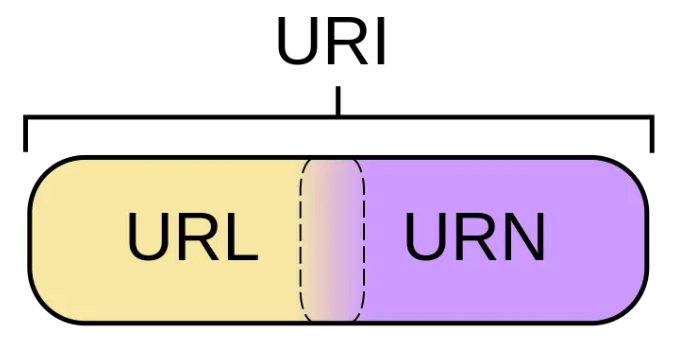
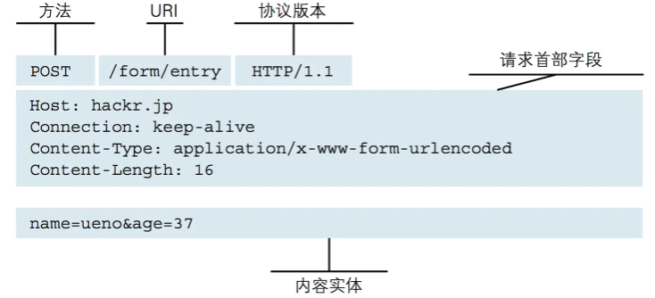
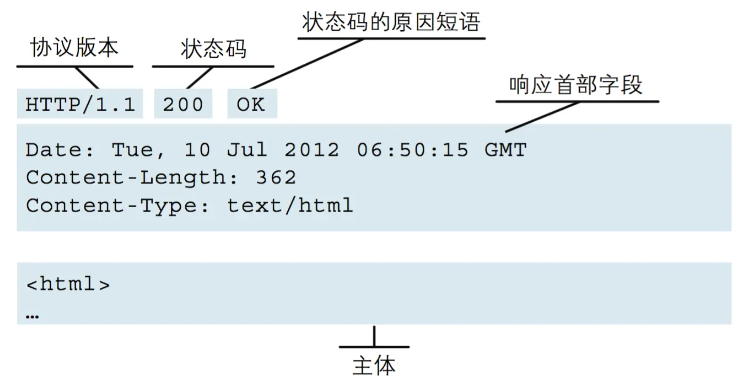

# HTTP协议

> Web使用一种名为HTTP（HyperText Transfer Protocol，超文本传输协议）的协议作为规范，完成从客户端到服务器等一系列运作流程。而协议是指规则的约定。可以说，Web是建立在HTTP协议上通信的。

HTTP协议定义Web客户端如何从Web服务器请求Web页面，以及服务器如何把Web页面传送给客户端。

客户端向服务器发送一个请求报文，请求报文包含请求的方法、URL、协议版本、请求头部和请求数据。服务器以一个状态行作为响应，响应的内容包括协议的版本、成功或者错误代码、服务器信息、响应头部和响应数据。

HTTP是不保存状态的协议，既无状态协议，协议本身对于请求或响应之间的通信状态不进行保存，因此连接双方不能知晓对方当前的身份和状态。这也是Cookie技术产生的重要原因之一：客户端的状态管理。浏览器会根据从服务器端发送的响应报文内 Set-Cookie 首部字段信息自动保持 Cookie。而每次客户端发送 HTTP 请求，都会在请求报文中携带 Cookie，作为服务端识别客户端身份状态的标识。

## TCP/IP 协议族

TCP/IP 协议族是Internet最基本的协议，HTTP协议是它的一个子集。TCP/IP协议族按层次分为以下四层：

- **应用层**

  应用层规定了向用户提供应用服务时通信的协议，如：

  TCP/IP 协议族内预存了各类通用的应用服务协议。比如，FTP（File Transfer Protocol，文件传输协议）、DNS（Domain Name System，域名系统）以及HTTP协议。

- **传输层**

  传输层对接上层应用层，提供处于网络连接中两台计算机之间的数据传输所使用的协议。

  在传输层有两个性质不同的协议：TCP（Transmission Control Protocol，传输控制协议）和UDP（User Data Protocol，用户数据报协议）。

  TCP协议是全双工的，即发送数据和接收数据是同步进行的，TCP协议在建立和断开连接时有三次握手和四次挥手，因此在传输的过程中更稳定可靠但同时就没UDP那么高效了。

  UDP协议是面向无连接的，也就是说在正式传递数据之前不需要先建立连接。UDP 协议不保证有序且不丢失的传递到对端，也就是说不够稳定，但也正因如此，UDP协议比TCP更加高效和轻便。

- **网络层**

  网络层规定了数据通过怎样的传输路线到达对方计算机传送给对方（IP协议等）。

  与对方计算机之间通过多台计算机或网络设备进行传输时，网络层所起的所用就是在众多的选项内选择一条传输路线。

- **链路层**

  用来处理连接网络的硬件部分，包括控制操作系统、硬件的设备驱动、NIC（Network Interface Card，网络适配器，即网卡），及光纤等物理可见部分（还包括连接器等一切传输媒介）。硬件上的范畴均在链路层的作用范围之内。

## 连接

- **串行连接：** HTTP有无连接的特性，即每次连接只能处理一个请求，收到响应后立即断开连接。HTTP/1.0 版本（称为串行连接或短连接、短轮询）中每次HTTP通信后都要断开TCP连接，所以每个新的HTTP请求都需要建立一个新的连接。但在现在网站动则几十条HTTP请求的情况下，很容易达到浏览器请求上限，并且每次请求都建立新的tcp连接（每次都有三次握手四次挥别）极大的增加了通信开销。
- **持久连接：** 为解决这个问题，有人提出了持久连接（也叫长连接、长轮询）。一定时间内，同一域名下的HTTP请求，只要两端都没有提出断开连接，则持久保持TCP连接状态，其他请求可以复用这个连接通道。HTTP/1.1 实现并默认了所有连接都是持久连接，这样客户端发起多个HTTP请求时就减少了TCP握手造成的网络资源和通信时间的浪费。但是持久连接采用阻塞模式，下次请求必须等到上次响应返回后才能发起，如果上次的请求还没返回响应内容，下次请求就只能等着（就是常说的线头阻塞）。
- **管道化持久连接：** 管道化则可以不用等待响应返回而发送下个请求并按顺序返回响应，现代浏览器并未默认开启管道化。
- **HTTP/2.0多路复用：** 每个HTTP请求都有一个序列标识符，这样浏览器可以并发多个请求，服务器接收到数据后，再根据序列标识符重新排序成不同的请求报文，而不会导致数据错乱。同样，服务端也可以并发返回多个响应给浏览器，浏览器收到后根据序列标识重新排序并归入各自的请求的响应报文。并且同一个域名下的所有请求都复用同一个TCP连接，极大增加了服务器处理并发的上限。
- **WebSocket：** WebSocket是HTML5提出的一种客户端和服务端通讯的全双工协议，由客户端发起请求，建立连接之后不仅客户端可以主动向服务端发送请求，服务端可以主动向客户端推送信息。

## URI

HTTP协议使用 URI 定位互联网上的资源。概念：

- URI(Universal Resource Identifier：统一资源标识符)
- URL(Universal Resource Locator：统一资源定位符)
- URN(Universal Resource Name：统一资源名称)。



# HTTP版本

## HTTP1.0

最早的http只是使用在一些较为简单的网页上和网络请求上，所以比较简单，每次请求都打开一个新的TCP链接，收到响应之后立即断开连接。

## HTTP1.1

- 引入了更多的缓存控制策略例如Entity tag，If-Unmodified-Since, If-Match, If-None-Match等更多可供选择的缓存头来控制缓存策略。
- HTTP1.0中，存在一些浪费带宽的现象，例如客户端只是需要某个对象的一部分，而服务器却将整个对象送过来了，并且不支持断点续传功能，HTTP1.1则在请求头引入了`range`头域，它允许只请求资源的某个部分
- 新增了24个错误状态响应码
- ，在HTTP1.0中认为每台服务器都绑定一个唯一的IP地址，因此，请求消息中的URL并没有传递主机名。在一台物理服务器上可以存在多个虚拟主机，并且它们共享一个IP地址。HTTP1.1的请求消息和响应消息都应支持Host头域，且请求消息中如果没有Host头域会报告一个错误。
- 支持长连接和请求的流水线处理，在一个TCP连接上可以传送多个HTTP请求和响应，减少了建立和关闭连接的消耗和延迟，在HTTP1.1中默认开启Connection： keep-alive，一定程度上弥补了HTTP1.0每次请求都要创建连接的缺点。

## SPDY

- 针对HTTP高延迟的问题，SPDY优雅的采取了多路复用。通过多个请求stream共享一个tcp连接的方式，解决了线头阻塞的问题，降低了延迟同时提高了带宽的利用率。
- 多路复用带来一个新的问题是，在连接共享的基础之上有可能会导致关键请求被阻塞。SPDY允许给每个request设置优先级，这样重要的请求就会优先得到响应。
- HTTP1.x的header很多时候都是重复多余的，选择合适的压缩算法减小包的大小和数量。
- 基于HTTPS的加密协议传输，大大提高了传输数据的可靠性。
- 采用了SPDY的网页，例如我的网页有一个sytle.css的请求，在客户端收到sytle.css数据的同时，服务端会将sytle.js的文件推送给客户端，当客户端再次尝试获取sytle.js时就可以直接从缓存中获取到，不用再发请求了。

## HTTP2.0

- HTTP2.0的协议解析决定采用二进制格式，实现方便且健壮。
- 多路复用：每一个request都是是用作连接共享机制的。一个request对应一个id，这样一个连接上可以有多个request，每个连接的request可以随机的混杂在一起，接收方可以根据request的 id将request再归属到各自不同的服务端请求里面。
- HTTP2.0使用encoder来减少需要传输的header大小，通讯双方各自cache一份header fields表，既避免了重复header的传输，又减小了需要传输的大小。
- HTTP2.0也具有server push功能。

## HTTP3.0

HTTP/2.0 使用了多路复用，一般来说同一域名下只需要使用一个 TCP 连接。但当这个连接中出现了丢包的情况，那就会导致整个 TCP 都要开始等待重传，也就导致了后面的所有数据都被阻塞了。反而对于 HTTP/1.0 来说，可以开启多个 TCP 连接，出现丢包反倒只会影响其中一个连接，剩余的 TCP 连接还可以正常传输数据。 出现包阻塞的原因是因为底层TCP协议导致的问题，但是修改TCP协议是不现实的问题。Google 基于 UDP 协议推出了一个的 QUIC 协议，并且使用在了 HTTP/3 上。

QUIC 基于 UDP，但是UDP本身存在不稳定性等诸多问题，所以QUIC在UDP的基础上新增了很多功能，比如多路复用、0-RTT、使用 TLS1.3 加密、流量控制、有序交付、重传等等功能。

- 基于UDP的QUIC协议中，不同的流之间的数据传输真正实现了相互独立互不干扰，某个流的数据包在出问题需要重传时，并不会对其他流的数据包传输产生影响。
- 快速重启会话：普通基于tcp的连接，是基于两端的ip和端口和协议来建立的。在网络切换场景，例如手机端切换了无线网，使用4G网络，会改变本身的ip，这就导致tcp连接必须重新创建。而QUIC协议使用特有的UUID来标记每一次连接，在网络环境发生变化的时候，只要UUID不变，就能不需要握手，继续传输数据。

# HTTP报文

用于HTTP协议交互的信息被称为HTTP报文。客户端的HTTP报文叫请求报文，服务端的HTTP报文叫响应报文。

**请求报文** 是由请求行（请求方法、协议版本）、请求首部（请求URI、客户端信息等）和内容实体（用户信息和资源信息等，可为空）构成。



**响应报文** 是由状态行（协议版本、状态码）、响应首部（服务器名称、资源标识等）和内容实体（服务端返回的资源信息）构成。



## 请求方法

- GET：get方法一般用于获取服务器资源
- POST：post方法一般用于传输实体主体
- PUT：put方法一般用于传输文件
- DELETE：delete方法用于删除文件
- HEAD：head方法用于获取报文首部，不返回报文主体
- OPTIONS：options方法用于询问请求URI资源支持的方法

## 状态码

| 2    | 成功（请求被正常处理）                     |
| ---- | ------------------------------------------ |
| 200  | 表示从客户端发来的请求在服务器端被正确处理 |
| 204  | 表示请求成功，但响应报文不含实体的主体部分 |
| 206  | 进行范围请求成功                           |

|  3   | 重定向（浏览器需要执行特殊处理）                             |
| :--: | ------------------------------------------------------------ |
| 301  | 永久性重定向，表示资源已被分配了新的 URL                     |
| 302  | 临时性重定向，表示资源临时被分配了新的 URL                   |
| 303  | 表示资源存在着另一个 URL，应使用 GET 方法获取资源（对于301/302/303响应，几乎所有浏览器都会删除报文主体并自动用GET重新请求） |
| 304  | 协商缓存，与重定向无关                                       |
| 307  | 临时重定向，和302含义类似，但是期望客户端保持请求方法不变向新的地址发出请求 |

| 4    | 客户端错误                                                   |
| ---- | ------------------------------------------------------------ |
| 400  | 请求报文存在语法错误                                         |
| 401  | 表示发送的请求需要有通过 HTTP 认证的认证信息                 |
| 403  | 表示对请求资源的访问被服务器拒绝，可在实体主体部分返回原因描述 |
| 404  | 表示在服务器上没有找到请求的资源                             |

| 5    | 服务器错误                                           |
| ---- | ---------------------------------------------------- |
| 500  | 表示服务器端在执行请求时发生了错误                   |
| 501  | 表示服务器不支持当前请求所需要的某个功能             |
| 503  | 表明服务器暂时处于超负载或正在停机维护，无法处理请求 |

# WEB安全防范

## XSS攻击

XSS 攻击全称跨站脚本攻击，是利用html可以执行`<script>alert(1)</script>`的特性，想尽办法将脚本注入页面中的攻击手段。XSS攻击有两种，一种是通过修改浏览器URL导致脚本被注入到页面，另一种是通过输入框将脚本代码注入数据库。前面一种会被chrome浏览器自动防御攻击（但最好还是手动也防御一下），后面一种则需要我们手动防御，推荐使用'xss'库的白名单过滤防御方法

```js
const xss = require('xss')
let html = xss('<h1 id="title">XSS Demo</h1><script>alert("xss");</script>')
```

## CSRF攻击

CSRF中文名为跨站请求伪造。假如某GET接口，id参数是关注人Id

```js
https://juejin.im?id=5cd0438c6fb9a031ec6d3ab2
```

那我只需要在我的一个页面里面写一个img标签：

```js

```

那么只要有已经登录的用户打开我这个页面，就会自动关注我。 就算是改为POST请求，也可以通过在页面使用form表单提交的方式自动关注。 CSRF攻击是源于Web的隐式身份验证机制！Web的身份验证机制虽然可以保证一个请求是来自于某个用户的浏览器，但却无法保证该请求是用户批准发送的。CSRF攻击的问题一般是由服务端解决，防范 CSRF 攻击可以遵循以下几种规则：

1. Get 请求不用于对数据进行修改
2. Cookie设置`HTTP Only`
3. 接口设置禁止跨域
4. 请求时附带验证信息，比如验证码或者 Token

## 点击劫持

点击劫持是一种视觉欺骗的攻击手段。攻击者将需要攻击的网站通过 iframe 嵌入自己的网页中，并将 iframe 设置为透明，然后诱使用户在该页面上进行操作，此时用户将在不知情的情况下点击透明的iframe页面

解决方法：

使用一个HTTP响应头——`X-Frame-Options`。`X-Frame-Options`可以说是为了解决点击劫持而生的，它有三个可选的值：

1. DENY：浏览器会拒绝当前页面加载任何frame页面；
2. SAMEORIGIN：frame页面的地址只能为同源域名下的页面；
3. ALLOW-FROM origin：允许frame加载的页面地址；

## 中间人攻击

中间人攻击是攻击方同时与服务端和客户端建立起了连接，并让对方认为连接是安全的，但是实际上整个通信过程都被攻击者控制了。攻击者不仅能获得双方的通信信息，还能修改通信信息。中间人攻击的本质是客户端和服务端之间的认证和信任问题。

对称加密、非对称加密、混合加密技术都没有有效防止中间人攻击，因为中间人可以截取首次传输的密钥并偷天换日，而客户端或服务端并无法得知。HTTPS作为防止中间人攻击的终极手段，引入证书机制解决了客户端和服务端的信任问题，从而较为有效的防止了中间人攻击。
