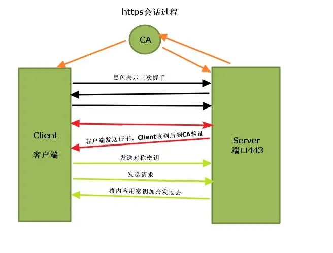

# SSL加密

## 基础知识

HTTPS之所以安全就是因为加持了SSL这个来对传输的数据进行加密；

先了解两个概念：

- 对称加密
- 非对称加密

### 对称加密

也称为对称密码,是指在加密和解密时使用同一密钥得加密方式。

> **密钥配送问题**：在对称加密中，在双方确定密钥时需要传输密钥，但密钥本身也是信息，想加密就要给对方发密钥，但发密钥又不能保证密钥的安全。
>
> 解决方案：
>
> 1. 事先共享密钥
> 2. 密钥分配中心
> 3. Diffie-Hellman密钥交换
> 4. 非对称加密

### 非对称加密

也称为公钥密码，需要四个密钥，通信双方各准备一对公钥和私钥，其中公钥是公开的，由信息接受方提供给信息发送方。公钥用来对信息加密，私钥有信息接收方保留，用来解密。

**公钥只能用做数据加密。公钥加密的数据，只能用对应的私钥才能解密。这是非对称加密的核心概念**。

> 解密过程：
>
> 1、消息**接收方**准备好公钥和私钥
>
> 2、私钥**接收方**自己留存、公钥发布给消息**发送方**
>
> 3、消息**发送方**使用接收方公钥对消息进行加密
>
> 4、消息**接收方**用自己的私钥对消息解密

### 非对称加密算法

RSA 是现在使用最为广泛的非对称加密算法，RSA 加解密算法其实很简单：

密文=明文^E mod N

明文=密文^D mod N

E 和 N 是RSA加密的密钥，换句话说，E 和 N 的组合就是公钥，表示为公钥是(E,N)

在已知密文的情况下，只要只要 D 和 N 这两个数，任何人都可以完成对解密的运算。所以说， D 和 N 是RSA解密的密钥，换句话说，D 和 N 的组合就是私钥，表示为私钥是(D,N)

由上述分析可知，加解密的过程需要三个参数 E、D、N，那么这三个参数该怎么生成呢？由于 E 和 N 是公钥，D 和 N 是私钥，求这三个数的过程就是生成密钥对。**生成步骤如下**：

1、求 N

首先需要准备两个很大质数 a 和 b。太小容易破解，太大计算成本太高。我们可以用 512 bit 的数字，安全性要求高的可以使用 1024，2048 bit。

N=a*b

2、求 L

L 只是生成密钥对过程中产生的数，并不参与加解密。L 是 (a-1) 和 (b-1) 的最小公倍数

3、求 E（公钥）

E 有两个限制：

1<E<

E和L的最大公约数为1

第一个条件限制了 E 的取值范围，第二个条件是为了保证有与 E 对应的解密时用到的 D。

4、求 D（私钥）

D 也有两个限制条件：

1<D<L

E*D mod L = 1

第二个条件确保密文解密时能够成功得到原来的明文。

**SSL加密，正是采用了基于RSA算法的非对称加密算法；**

## 传统方案

在公钥发送的过程，当服务端将自己的公钥发给对端时，如何证明发出的公钥就是自己的？这需要一个第三方来证明自己。

解决思路：双方找到一个可信的第三方，有第三方确公钥是他自己的

在实际中，这个第三方，就是CA机构，即一个服务端和客户都可信任的机构

**CA怎么证明服务端？**

解决：数字证书，CA通过数字证书来证明服务端的公钥就是他自己的。

数字证书：数字证书就是互联网通讯中标志通讯各方身份信息的一串数字，提供了一种在Internet上验证通信实体身份的方式，数字证书不是数字身份证，而是身份认证机构盖在数字身份证上的一个章或印（或者说加在数字身份证上的一个签名）。

数字证书具体包含:

- 签发证书的机构
- 加密算法
- Hash算法
- 公钥
- 证书到期时间等

**客户端怎么确认第三方的证词**？

当客户端接收到服务端发来的公钥后要找CA进行验证，但找CA的过程就要去和CA链接请求数据，去CA请求数据还需要找到一个新的CA来验证，那就进入了死循环

为了跳出循环，就要求我们的操作系统在出厂时先预制CA的证书（公钥），也就是说，当去找CA验证的时候就不用再去网上请求数据，直接从本地证书中查询。

也就是说，客户端可以通过预置的CA证书中的公钥来加密信息来与CA进行可信的通话

## 具体流程

首先，客户端已经预置CA证书，其中包含CA的公钥，用来解密CA私钥加密的信息

1、服务端向CA提交申请材料，就是写证书时提交的个人信息，包括服务端公钥信息，Hash算法等。提交后CA机构就会给服务端签名，可以理解为给材料盖了个章。具体是加在服务端的公钥上。为了防止被仿造，还需要给这个签名加密：

- 首先，根据服务端的材料生成一个由服务端提交的Hash算法产生的hash值，这个值是唯一的（可以理解为证书编号），把这个值称为HASH-CA。
- HASH-CA可能会被替换，因此继续加密，CA会用自己的私钥将服务端提交的材料以及HASH-CA一同加密。

2、服务端获得CA颁发的证书

3、客户端使用SSL链接服务端，并进行安全对话（发送请求，获取公钥）

4、服务端将CA颁发的证书给客户端

5、客户端使用预置的CA公钥解开CA的加密内容，获取到了服务端提交的材料和CA机构提供的HASH-CA

6、客户端根据材料中的HASH算法得到唯一的HASH值（证书编号），HASH-Clinet；用这个值去对比证书里的HASH-CA，若两个值相等，说明CA确认五负端的公钥没有修改过。

一次SSL加密证书交换的过程完毕
