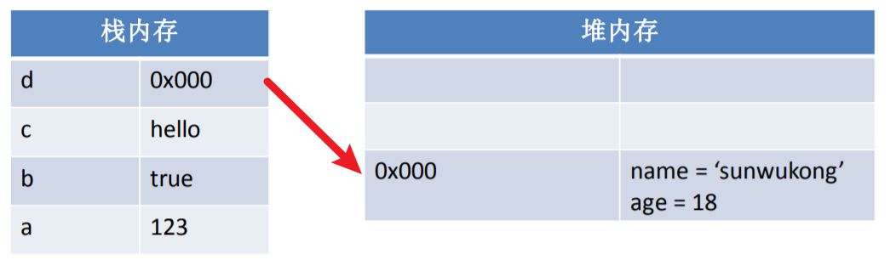
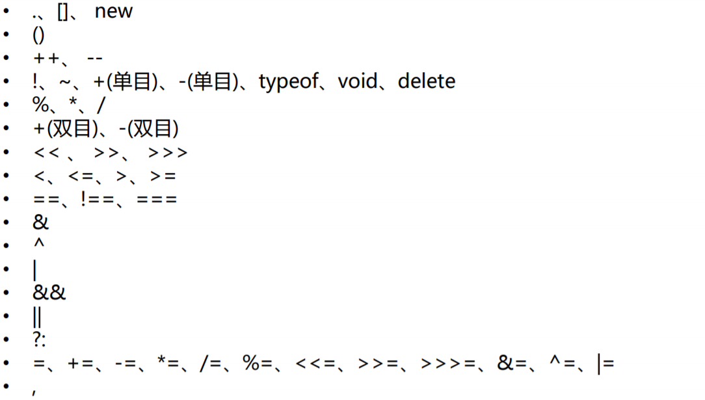

# JS基础

## 数据类型

### 基本数据类型

基本数据类型的值是无法修改的，是不可变的。

  JavaScript中一共有7种基本数据类型：

- 字符串型（String）

- 数值型（Number）

- 布尔型（Boolean）

- undefined型（Undefined):在使用 var 声明变量但未对其加以初始化时，这个变量就是undefined。

- null型（Null）

- symbol型（ES6新增）

- BigInt（ES11新增）

**undefined值实际上是由null值衍生出来的，所以如果比较undefined和null是否相等，会返回true。**

**这7种之外的类型都称为Object，所以总的来看JavaScript中共有八种数据类型。**

> **注意**：从语义上看null表示的是一个空的对象，所以使用typeof检查null会返回一个Object。

#### **symble**

- Symbol 的值是唯一的，用来解决命名冲突的问题
- Symbol 值不能与其它数据进行运算
- Symbol 定义的对象属性不能使用 `for…in` 循环遍 历 ，但是可以使用 `Reflect.ownKeys` 来获取对象的所有键名

| 内置值                    | 描述                                                         |
| ------------------------- | ------------------------------------------------------------ |
| Symbol.hasInstance        | 当其它对象使用 instanceof 运算符，判断是否为该对象的实例时，会调用这个方法 |
| Symbol.isConcatSpreadable | 对象的 Symbol.isConcatSpreadable 属性等于的是一个布尔值，表示该对象用于 Array.prototype.concat()时， 是否可以展开 |
| Symbol.species            | 创建衍生对象时，会使用该属性                                 |
| Symbol.match              | 当执行 str.match(myObject) 时，如果该属性存在，会调用它，返回该方法的返回值 |
| Symbol.replace            | 当该对象被 str.replace(myObject)方法调用时，会返回该方法的返回值 |
| Symbol.search             | 当该对象被 str.search (myObject)方法调用时，会返回该方法的返回值 |
| Symbol.split              | 当该对象被 str.split(myObject)方法调用时，会返回该方法的返回值 |
| Symbol.iterator           | 当对象进行 for…of 循环时，会调用 Symbol.iterator 方法， 返回该对象的默认遍历器 |
| Symbol.toPrimitive        | 当对象被转为原始类型的值时，会调用这个方法，返 回该对象对应的原始类型值 |
| Symbol. toStringTag       | 当对象上面调用 toString 方法时，返回该方法的返 回值          |
| Symbol. unscopables       | 当对象指定了使用 with 关键字时，哪些属性会被 with 环境排除   |

#### Bigint

JS 中的`Number`类型只能安全地表示`-9007199254740991 (-(2^53-1))` 和`9007199254740991(2^53-1)`之间的整数，任何超出此范围的整数值都可能失去精度。

`BigInt`数据类型的目的是比`Number`数据类型支持的范围更大的整数值。在对大整数执行数学运算时，以任意精度表示整数的能力尤为重要。使用`BigInt`，整数溢出将不再是问题。此外，可以安全地使用更加准确时间戳，大整数ID等，而无需使用变通方法。

```js
//定义BigInt只需要在数字的后边加上一个n
let n = 521n;
//普通整数转化为bigint
let n = 123;
console.log(BigInt(n));
//不能使用浮点数进行转换
console.log(BigInt(0.2));
```

### 引用数据类型

引用类型的值是保存在内存中的对象。

当一个变量是一个对象时，实际上变量中保存的并不是对象本身，**而是对象的引用**。

当从一个变量向另一个变量复制引用类型的值时，*会将对象的引用复制到变量中，并不是创建一个新的对象*。

这时，两个变量指向的是同一个对象。因此，**改变其中一个变量会影响另一个**。

### 栈和堆

JavaScript在运行时数据是保存到栈内存和堆内存当中的。

简单来说栈内存用来保存变量和基本类型，堆内存是用来保存对象。

我们在声明一个变量时，实际上就是在栈内存中创建了一个空间用来保存变量。

如果是基本类型则在栈内存中直接保存，如果是引用类型则会在堆内存中保存，变量中保存的实际上对象在堆内存中的地址。

```js
var a = 123;
var b = true;
var c = "hello";
var d = {name: 'sunwukong', age: 18};
```



## 强制类型转换

### 转换为string

1. 调用被转换数据类型的toString()方法，该方法***不会影响到原变量***，它会将转换的结果返回，但是注意：**null和undefined这两个值没有toString()方法，如果调用它们的方法，会报错。**

   ```js
   var a = 123;
   a = a.toString();
   ```

2. 调用String()函数，**并将被转换的数据作为参数传递给函数**，使用String()函数做强制类型转换时，对于Number和Boolean实际上就是调用的toString()方法，但是对于null和undefined，就不会调用toString()方法，**它会将 null 直接转换为 “null”，将 undefined 直接转换为 “undefined”。**

3. 任意的数据类型 `+""`

### 转换为number

1. 使用Number()函数
   - 字符串 --> 数字
     - 如果是纯数字的字符串，则直接将其转换为数字
     - 如果字符串中有非数字的内容，则转换为NaN
     - 如果字符串是一个空串或者是一个全是空格的字符串，则转换为0
   - 布尔 --> 数字
     - true 转成 1
     - false 转成 0
   - null --> 数字
     - null 转成 0
   - undefined --> 数字
     - undefined 转成 NaN
2. **这种方式专门用来对付字符串**，par() 把一个字符串转换为一个**整数**
3. **这种方式专门用来对付字符串**，parseFloat() 把一个字符串转换为一个**浮点数**

### 转换为boolean

**将其它的数据类型转换为Boolean，只能使用Boolean()函数。**

- 使用Boolean()函数
  - 数字 —> 布尔
    - 除了0和NaN，其余的都是true
  - 字符串 —> 布尔
    - 除了空串，其余的都是true
  - null和undefined都会转换为false
  - 对象也会转换为true

## 字面量和变量

**字面量**实际上就是一些固定的值，比如：1、2 、3、true、false、null、NaN、“hello”，字面量都是不可以改变的，由于字面量不是很方便使用，所以在JavaScript中很少直接使用字面量，使用的而是变量。

**变量**是松散类型，意思是可以用于保存任何类型的数据。每个变量是一个用于保存任意值的命名占位符。有三个关键字可以声明变量：var,const,let.其中var在所有版本中都可以使用，const,let只能在ES6以及更晚的版本中使用。

## 检查变量的数据类型

1. typeof

   - typeof它返回值是一个字符串，该字符串说明运算数的类型。返回结果只有以下几种：`number，string，boolean，object，undfined，function`
   - 无法判断`对象和数组`，还有`null`，因为都返回的是`object`

   > 可以使用typeof判断变量是否存在（比如 if(typeof a!=“undfined”){ xxx }），而不要去使用if(a),因为a不存在（未声明）会报错。

   ```js
   console.log(typeof(1))
   ```

   > typeof 在判断一个 object的数据的时候只能告诉我们这个数据是 object, 而不能细致的具体到是哪一种 object。所以要 **想区分对象、数组、null，单纯使用 typeof 是不行的**。

2. instanceof

   instanceof 是用来 判断数据是否是某个对象的实例，返回一个`布尔值`，即可以判断数据类型。

   ```js
   console.log(1 instanceof Number)
   ```

   > `对于基本类型的数据，instanceof是不能直接判断它的类型的`，因为实例是一个对象或函数创建的，是引用类型，所以需要通过基本类型对应的 包装对象 来判断。所以对于 `null` 和 `undefined` 就检测不了
   >
   > 因为原型链继承的关系，instanceof 会把数组都识别为 Object 对象，所有引用类型的祖先都是 Object 对象

3. Object.prototype.toString.call()

   在判断数据类型时， Object.prototype.toString在工作中也是比较常用而且准确。
   对于Object.prototype.toString() 方法，会返回一个形如 “[object XXX]” 的字符串

   > 使用`const _toStr = Object.prototype.toString`是因为，toString实在是太容易被重写了。如果toString被其他人重写，将会对代码中涉及到的部分造成影响，所以就保存下来防止这种情况发生
   
   ```js
   Object.prototype.toString.call('stjd')
   //"[object String]"
    
   Object.prototype.toString.call(1)
   //"[object Number]"
    
   Object.prototype.toString.call(true)
   //"[object Boolean]"
   
   Object.prototype.toString.call(null)
   //"[object Null]"
   
   Object.prototype.toString.call(undefined)
   //"[object Undefined]"
   Object.prototype.toString.call(function(){})
   // "[object Function]"
   var date = new Date();
   Object.prototype.toString.call(date);
   //”[object Date]”
   Object.prototype.toString.call([2])
   //"[object Array]"
   Object.prototype.toString.call({q:8})
   //"[object Object]"
   var reg = /[hbc]at/gi;
   Object.prototype.toString.call(reg);
   // "[object RegExp]"
   ```

   > Object.prototype.toString.call(1) 和 Object.prototype.toString.call(new Number(1))时，返回的都是"[object Number]"，也就是说，它并不能区分原始类型和复杂类型.
   
   ```js
   //这种方法不能准确判断person是Person类的实例，而只能用instanceof 操作符来进行判断
   function Person(name, age) {
       this.name = name;
       this.age = age;
   }
   var person = new Person("Rose", 18);
   Object.prototype.toString.call(person); 
   //”[object Object]”
   console.log(person instanceof Person);//输出结果为true
   ```
   

## 运算符

| 运算符     |                                       |                             备注                             |
| :--------- | :-----------------------------------: | :----------------------------------------------------------: |
| 算数运算符 |         +  -  *  /  %  ++ --          |                                                              |
| 关系运算符 |             <  >  >=  <=              |                                                              |
| 赋值运算符 |         =  +=  -=  *=  /=  %=         |                                                              |
| 逻辑运算符 |              &&  \|\|  !              |                                                              |
| 比较运算符 |           ==  !=  ===  !==            | 比较运算符用来比较两个值是否相等，如果相等会返回true，否则返回false。使用==,!=比较时如果类型不同则会自动进行类型转换为相同的类型再进行比较，===和!==则不会。 |
| 条件运算符 | variablename=condition?value1:value2; | 如果condition为true，则执行语句1，并返回执行结果，如果为false，则执行语句2，并返回执行结果。 |

运算符优先级


## 条件语句

### if...else

```js
if(expression1)
    statement
else if(expression2)
    statement
else
    statement 
```

### switch...case

switch语句更适用于多条分支使用同一条语句的情况。

```js
switch (语句) {
    case 表达式1:
        语句...
    case 表达式2:
        语句...
    default:
        语句...
}
```

> **注意：一旦符合case的条件程序会一直运行到结束，所以我们一般会在case中添加break作为语句的结束。**

## 循环语句

### while

```js
while(条件表达式){
    语句...
}
```

### do...while

do…while和while非常类似，只不过它会在循环的尾部而不是顶部检查表达式的值，因此，do…while循环会至少执行一次。相比于while，do…while的使用情况并不 是很多。

```js
do{
    语句...
}while(条件表达式);
```

### for

for语句也是循环控制语句，我们也称它为for循环。大部分循环都会有一个计数器用以控制循环执行的次数， 计数器的三个关键操作是初始化、检测和更新。for语句 就将这三步操作明确为了语法的一部分。

```js
for(初始化表达式 ; 条件表达式 ; 更新表达式){
    语句...
}
//eg:
for (var i = 1; i <= 10; i++) {
    console.log(i);
}
```

### 跳转控制

- break：结束最近的一次循环，可以在循环和switch语句中使用。
- continue：结束本次循环，执行下一次循环，只能在循环中使用。

想要跳出多层循环或者跳到指定位置，可以为循环语句创建一个label，来标识当前的循环，如下例子：

```js
outer: for (var i = 0; i < 10; i++) {
    for (var j = 0; j < 10; j++) {
        if (j == 5) {
            break outer;//结束outer循环
        }
        console.log(j);
    }
}
//outer:标识循环
```

## 对象基础

Object类型，我们也称为一个对象，是JavaScript中的引用数据类型。它是一种复合值，它将很多值聚合到一起，可以通过名字访问这些值。对象也可以看做是属性的无序集合，每个属性都是一个名/值对。对象除了可以创建自有属性，还可以通过从一个名为原型的对象那里继承属性。除了字符串、数字、true、false、null和undefined之外，JavaScript中的值都是对象。

### 创建对象

```js
var person = new Object();
person.name = "abc";
person.age = 18;
//-----------------------
var person = {
    name: "abc",
    age: 18
};
```

### 访问属性

1、对象.属性名  2、对象['属性名']

### 删除属性

delete 对象.属性名

### 遍历对象

```js
//遍历对象中的属性
for (var 变量 in 对象) {
}
//-------------------------------------------
var person = {
    name: "zhangsan",
    age: 18
}

for (var personKey in person) {
    var personVal = person[personKey];
    console.log(personKey + ":" + personVal);
}
//===========================================
name:zhangsan
age:18
```

## 对象进阶

### 用工厂方法创建对象

循环创建多个对象

~~~JavaScript
// 使用工厂模式创建对象
function createPerson(name, age) {
    // 创建新的对象
    var obj = new Object();
    // 设置对象属性
    obj.name = name;
    obj.age = age;
    // 设置对象方法
    obj.sayName = function () {
        console.log(this.name);
    };
    //返回新的对象
    return obj;
}

var person1 = createPerson("孙悟空", 18);
var person2 = createPerson("猪八戒", 19);
var person3 = createPerson("沙和尚", 20);
//=================================================
for (var i = 1; i <= 1000; i++) {
    var person = createPerson("person" + i, 18);
}
~~~

### 用构造函数创建对象

**我们要是既想实现创建对象的功能，同时又能明确所创建出来的对象，这就用到了构造函数，每一个构造函数都可以理解为一个类别，用构造函数所创建的对象我们也成为*类的实例***

> 类定义对象的特征。它是对象的属性和方法的模板定义。简单说，“类”是生产对象的模板，通过类这个模板，可以毫不费劲地生产出无数个一样的对象，而不用通过一次次的定义去声明对象。而这些对象，因为具有一样的属性、一样的方法，所以将这些对象归为一个“类”，就像将人类归入人这一类一样。

构造函数就是一个普通的函数，创建方式和普通函数没有区别，不同的是构造函数习惯上首字母大写，构造函数和普通函数的还有一个区别就是调用方式的不同，普通函数是直接调用，而构造函数需要使用new关键字来调用


~~~JavaScript
// 使用构造函数来创建对象
function Person(name, age) {
    // 设置对象的属性
    this.name = name;
    this.age = age;
    // 设置对象的方法
    this.sayName = function () {
        console.log(this.name);
    };
}

var person1 = new Person("孙悟空", 18);
var person2 = new Person("猪八戒", 19);
var person3 = new Person("沙和尚", 20);
//可以使用 instanceof 运算符检查一个对象是否是一个类的实例，它返回true或false
console.log(person1 instanceof Person);

//person1/2/3中都有sayName()方法但他们不是同一个function实例。ES中的函数是对象，因此每次定义函数时，都会初始化一个对象。逻辑上讲，这个构造函数实际上是这样的：
function Person(name, age) {
    this.name = name;
    this.age = age;
    this.sayName = new Function("console.log(this.name)");//逻辑等价
    };
}
~~~

构造函数执行创建对象的过程：

1. 调用构造函数，它会立刻创建一个新的对象
2. 将新建的对象设置为函数中this，**在构造函数中可以使用this来引用新建的对象**（函数.this）
3. 逐行执行函数中的代码
4. 将新建的对象作为返回值返回

构造函数会将其定义的方法在每一个实例上都创建一遍

> 构造函数有点类似工厂方法，但是它创建对象和返回对象都给我们隐藏了，使用同一个构造函数创建的对象，我们称为一类对象，也将一个构造函数称为一个类。我们将通过一个构造函数创建的对象，称为是该类的实例。

### 原型

每一个对象的属性不一样这是一定的，但是它的方法似乎好像是一样的，如果创建n个，非常浪费内存。可以把函数抽取出来，作为全局函数，在构造函数中直接引用。

但要是涉及到多人协作开发一个项目，别人也有可能叫这个方法，这样在工程合并的时候就会导致一系列的问题，污染全局作用域，这就需要原型对象了。

~~~JavaScript
// 使用构造函数来创建对象
function Person(name, age) {
    // 设置对象的属性
    this.name = name;
    this.age = age;
}

// 在Person类的原型对象中添加方法
Person.prototype.sayName = function() {
    console.log(this.name);
};

var person1 = new Person("孙悟空", 18);
var person2 = new Person("猪八戒", 19);
var person3 = new Person("沙和尚", 20);
~~~

我们所创建的每一个函数，解析器都会向函数中添加一个属性prototype，这个属性对应着一个对象，这个对象就是我们所谓的原型对象，即显式原型，原型对象就相当于一个公共的区域，**所有同一个类的实例都可以访问到这个原型对象**，我们可以将对象中共有的内容，统一设置到原型对象中。

**理解原型：**

> 无论何时，只要创建一个函数，就会按照特定的规则为这个函数创建一个prototype属性(指向原型对象)。默认去情况下，所有的原型对象自动获得一个名为constructor的属性，指回与之关联的构造函数。Person.prototype.constructor指向Person。然后，因构造函数而异，可能会给原型对象中添加其他属性和方法。

如果函数作为普通函数调用prototype没有任何作用，当函数以构造函数的形式调用时，它所创建的对象中都会有一个隐含的属性，指向该构造函数的原型对象，我们可以通过`__proto__`（隐式原型）来访问该属性。当我们访问对象的一个属性或方法时，它会先在对象自身中寻找，如果有则直接使用，如果没有则会去原型对象中寻找，如果找到则直接使用。

以后创建构造函数时，可以将这些对象共有的属性和方法，统一添加到构造函数的原型对象中，这样不用分别为每一个对象添加，也不会影响到全局作用域，就可以使每个对象都具有这些属性和方法了。

### 原型链

访问一个对象的属性时，先在自身属性中查找，找到返回， 如果没有，再沿着`__proto__`这条链向上查找，找到返回，如果最终没找到，返回undefined，这就是原型链，又称隐式原型链，它的作用就是查找对象的属性(方法)。


### hasOwnProperty方法

遍历一个对象并判断当前对象是否包括指定的属性或者方法可以用in运算符来检查，若只想要检查自身对象是否含有某个方法或者属性可以用Object的hasOwnPorperty()方法，它是原型中的，在执行方法的时候它会通过原型链进行查找，这个方法是Object的特有方法，它返回一个布尔值，判断对象是否包含特定的自身(非继承)属性

> *使用in检查对象中是否含有某个属性时，如果对象中没有但是原型中有，也会返回true*
>
> *hasOwnProperty()来检查对象自身中是否含有该属性，使用该方法只有当对象自身中含有属性时，才会返回true*

```js
// 创造一个构造函数
function MyClass() {
}

// 向MyClass的原型中添加一个name属性
MyClass.prototype.name = "我是原型中的名字";

// 创建一个MyClass的实例
var mc = new MyClass();
mc.age = 18;

// 使用in检查对象中是否含有某个属性时，如果对象中没有但是原型中有，也会返回true
console.log("age" in mc);
console.log("name" in mc);

// 可以使用对象的hasOwnProperty()来检查对象自身中是否含有该属性，使用该方法只有当对象自身中含有属性时，才会返回true
console.log(mc.hasOwnProperty("age"));
console.log(mc.hasOwnProperty("name"));
```


## 函数

函数是由一连串的子程序（语句的集合）所组成的，可以被外部程序调用，向函数传递参数之后，函数可以返回一定的值。

通常情况下，JavaScript代码是自上而下执行的，不过函数体内部的代码则不是这样。如果只是对函数进行了声明，其中的代码并不会执行，只有在调用函数时才会执行函数体内部的代码。

这里要注意的是JavaScript中的函数也是一个对象，使用typeof检查一个函数对象时，会返回function。

### 函数创建

- 使用 **函数对象** 来创建一个函数（几乎不用）

  `[var 函数名 = new Function("执行语句");]()`

- 使用 **函数声明** 来创建一个函数（比较常用）

  ~~~JavaScript
  function 函数名([形参1,形参2,...,形参N]) {
      语句...
  }
  ~~~

- 使用 **函数表达式** 来创建一个函数（比较常用）

  ~~~javascript
  var 函数名  = function([形参1,形参2,...,形参N]) {
      语句....
  }
  ~~~

### 函数调用

```js
// 函数声明
var fun = function () {
    console.log("哈哈，我执行啦！");
}

// 函数调用
fun();
```

### 函数参数

- 调用函数时，解析器不会检查实参的类型，所以要注意，是否有可能会接收到非法的参数，如果有可能，则需要对参数进行类型的检查，函数的实参可以是任意的数据类型

- 调用函数时，解析器也不会检查实参的数量，**多余实参不会被赋值，如果实参的数量少于形参的数量，则没有对应实参的形参将是undefined**

### 函数返回值

可以使用 return 来设置函数的返回值，return后的值将会作为函数的执行结果返回，*可以定义一个变量，来接收该结果*。

> **注意：在函数中return后的语句都不会执行，如果return语句后不跟任何值就相当于返回一个undefined，如果函数中不写return，则也会返回undefined，return后可以跟任意类型的值**

~~~JavaScript
function sum(num1, num2) {
    return num1 + num2;
}

var result = sum(10, 20);
console.log(result);
~~~

### 嵌套函数

在函数中声明的函数就是嵌套函数，嵌套函数只能在当前函数中可以访问，**在当前函数外无法访问**。

### 匿名函数

没有名字的函数就是匿名函数，它可以让一个变量来接收，也就是用 “函数表达式” 方式创建和接收。

~~~JavaScript
var fun = function () {
    alert("我是一个匿名函数");
}

fun();
~~~

### 立即执行函数

函数定义完，立即被调用，这种函数叫做立即执行函数，立即执行函数往往只会执行一次。

~~~JavaScript
(function () {
    alert("我是一个匿名函数");
})();
~~~

### 对象中的函数

对象的属性值可以是任何的数据类型，也可以是个函数。

如果一个函数作为一个对象的属性保存，那么我们称这个函数是这个对象的方法，调用这个函数就说调用对象的方法（method）。

> 注意：方法和函数只是名称上的区别，没有其它别的区别

~~~JavaScript
var person = {
    name: "zhangsan",
    age: 18,
    sayHello: function () {
        console.log(name + " hello")
    }
}
~~~

### this对象

解析器在调用函数每次都会向函数内部传递进一个隐含的参数，这个隐含的参数就是this，this指向的是一个对象，这个对象我们称为函数执行的上下文对象，根据函数的调用方式的不同，this会指向不同的对象

- 以函数的形式调用时，this永远都是window
- 以方法的形式调用时，this就是调用方法的那个对象
- 当以构造函数的形式调用时，this就是新创建的那个对象

## 作用域

作用域指一个变量的作用的范围，在JS中一共有两种作用域：

- 全局作用域
- 函数作用域

#### 声明提前

- 变量的声明提前：使用**var关键字**声明的变量，会在所有的代码执行之前被声明（但是不会赋值），但是如果声明变量时不使用var关键字，则变量不会被声明提前

- 函数的声明提前：使用函数声明形式创建的函数 function 函数名(){} ，它会在所有的代码执行之前就被创建，所以我们可以在函数声明前来调用函数。使用函数表达式创建的函数，不会被声明提前，所以不能在声明前调用

#### 作用域

##### 全局作用域

- 直接编写在script标签中的JavaScript代码，都在全局作用域
- 全局作用域在页面打开时创建，在页面关闭时销毁
- 在全局作用域中有一个全局对象window，它代表的是一个浏览器的窗口，它由浏览器创建，我们可以直接使用
- 在全局作用域中：
  - 创建的变量都会作为window对象的属性保存
  - 创建的函数都会作为window对象的方法保存
- 全局作用域中的变量都是全局变量，**在页面的任意的部分都可以访问的到**

##### 函数作用域

- 调用函数时创建函数作用域，函数执行完毕以后，函数作用域销毁
- 每调用一次函数就会创建一个新的函数作用域，它们之间是互相独立的
- 在函数作用域中可以访问到全局作用域的变量，在全局作用域中无法访问到函数作用域的变量
- 在函数中要访问全局变量可以使用window对象
- 作用域链：当在函数作用域操作一个变量时，它会先在自身作用域中寻找，如果有就直接使用，如果没有则向上一级作用域中寻找，直到找到全局作用域，如果全局作用域中依然没有找到，则会报错ReferenceError

#### 作用域链

多个上下级关系的作用域形成的链，它的方向是从下向上的(从内到外)，查找变量时就是沿着作用域链来查找的。

查找一个变量的查找规则：

1. 在当前作用域下的执行上下文中查找对应的属性，如果有直接返回，否则进入2
2. 在上一级作用域的执行上下文中查找对应的属性，如果有直接返回，否则进入3
3. 再次执行2的相同操作，直到全局作用域，如果还找不到就抛出找不到的ReferenceError异常
