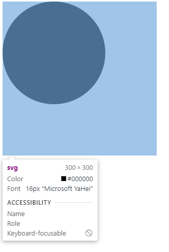
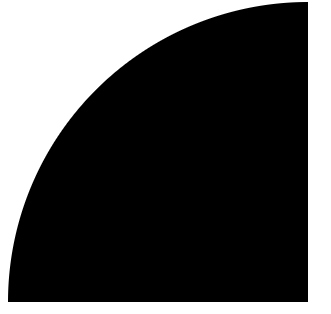
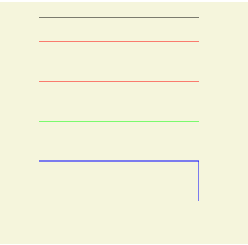
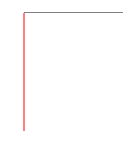
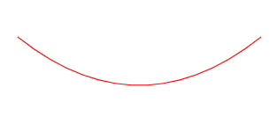
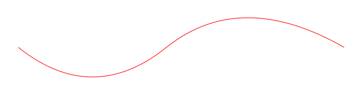
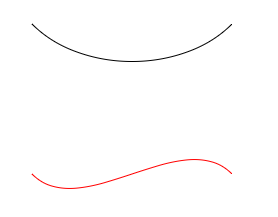
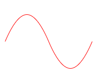
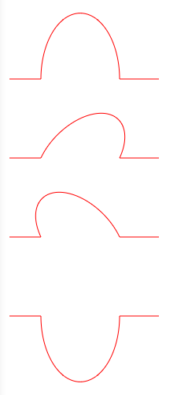

# 什么是svg

- SVG是 Scalable Vector Graphics 的缩写 意为可缩放矢量图形
- SVG是一个基于文本的开放网络标准，用来定义用于网络的矢量图形
- SVG图像在放大或改变尺寸的情况下其图形质量不会有所损失，因此能够优雅而简洁地渲染不同大小的图形，并和CSS，DOM，JavaScript和SMIL等其他网络标准无缝衔接
- SVG 使用 XML 格式定义图形
- SVG是万维网联盟的标准与诸如 DOM 和 XSL 之类的 W3C 标准是一个整体。

> 1. SVG复杂度越高渲染速度就会越慢（任何过度使用DOM的应用都不快）
> 2. SVG不适合游戏应用，只能结合Canvas来实现
> 3. SVG不能动态的修改动画内容

# 语法

SVG的绘制其实就是一个SVG标签，然后在标签内绘制你要绘制的内容

```html
 <svg>
    <circle cx="100" cy="100" r="50"/>
 </svg>
```

# 属性

## width、height

width、height设置用来设置SVG的宽高

```html
<svg width="300" height="300">
    <circle cx="100" cy="100" r="100"/>
</svg>
```



> 注意：在不设置宽高的情况下，默认为300 * 150，当内部元素大于300 * 150时，大于部分会被隐藏。

## viewBox

定义了SVG中可以显示的区域

语法：`viewBox="x y w h"` x、y为起始点，w、h为显示区域的宽高。

```js
<svg width="300" height="300" viewBox="0 0 100 100">
  <circle cx="100" cy="100" r="100"/>
</svg>
```



viewBox定义了一个：从（0, 0）点开始，宽高为100 * 100的显示区域。而这个100 * 100的显示区域会放到300 * 300(svg宽高)的SVG中去显示，整体就放大了3倍

## version

version属性用于指明SVG的版本，也就是指明SVG文档应该遵循的规范。version属性纯粹就是一个说明，对渲染或处理没有任何影响。

## xmlns、xmlns:xlink

在XML中，标签和属性属于命名空间，这是为了防止来自不同技术的标签和属性发生冲突。例如在SVG中存在a标签，在HTML中也存在a标签，那么怎么区分这个a标签属于哪一种技术，这就需要使用命名空间了。 加入命名空间以后我们就能知道哪一个是svg:a，哪一个又是html:a，这样我们就可以区分出不同的标签和属性。

xmlns用于声明命名空间（namespace），在此声明之下的所有子标签都属于这个空间内。

xmlns:xlink 表示前缀为xlink的标签和属性，应该由理解该规范的UA 使用xlink规范 来解释。

> UA是User Agent的简称。User Agent是Http协议中的一部分，属于头域的组成部分。通俗地讲UA是一种向访问网站提供你所使用的浏览器类型、操作系统、浏览器内核等信息的标识。

# 基本图形

## 圆形

circle 标签能在屏幕上绘制一个圆形

语法：`<circle cx="100" cy="100" r="100"/>`

属性：`cx、cy为圆的坐标，r为圆的半径`

## 矩形

rect标签能在屏幕上绘制一个矩形

语法：`<rect x="0" y="0" rx="5" ry="5" width="300" height="200"/>`

属性：`x、y为矩形的起始点坐标，rx、ry为圆角x、y轴方向的半径， width、height为矩形的宽高`

## 椭圆

ellipse标签比circle标签功能更强大，ellipse标签也可以实现圆形的绘制，并且还可以分别缩放圆形的长轴半径和短轴半径，从而达到椭圆的效果。

语法：`<ellipse cx="100" cy="100" rx="100" ry="50"/>`

属性：`cx、cy为椭圆的坐标，rx为椭圆的x轴半径、ry为椭圆的y轴半径`

## 线条

line标签可以根据两点的坐标绘制一条直线

语法：`<line x1="10" x2="50" y1="110" y2="150"/>`

属性：`x1、y1为起点的坐标，x2、y2为终点的坐标`

## 折线

polyline标签可以把很多个点链接在一起成为一条折线。

语法：`<polyline points="0 0, 20 40, 70 80, 100 90, 200 30, 250 50" />`

属性：`points为点集数列，其中每个点都必须包含2个数字，一个是x坐标，一个是y坐标。`

## 多边形

polygon标签和polyline标签类似，都是由很多个点链接在一起的。但不同的是polygon路径中的最后一个点和第一个点是默认闭合的。

语法：`<polygon points="0 0, 20 40, 70 80, 100 90, 200 30, 250 50" />`

属性：`points为点集数列，其中每个点都必须包含2个数字，一个是x坐标，一个是y坐标。`

## 路径

path标签是所有图形中最复杂的，但他也是最强大的。在SVG中最常用的图形就是path标签，他可以绘制圆形、椭圆、矩形、线条、折线、多边形、贝塞尔曲线等。

语法：`<path d="M50 50 H 200 V 200 H 50 L 50 50"/>`

属性：`d为一个点集数列以及其它绘制路径的信息。`

### 命令

path标签的图形形状是通过属性d来定义的，属性d的值是以：命令 + 参数 的形式进行组合的，命令又是通过关键字来表示的。大概有以下命令：

- M = Move to
- L = Line to
- H = Horizontal Line to
- V = Vertical Line to
- Q = Quadratic Bezier Curve to
- T = Smooth Quadratic Bezier Curve to
- C = Curve to
- S = Smooth Curve to
- A = Elliptical Arc
- Z = close path

> 注意：以下所有命令中 大写为绝对定位 小写为相对定位

#### 直线命令

直线命令的意思就是通过两个点画他们之间的直线。

##### M（Move to）

M命令其实就是把画笔移动到某个点，就好像画笔提起来以后移动到一个新的位置准备开始绘制。但因为仅仅是移动画笔而没有绘制，所以M命令经常出现在路径的起始点，用来指明画笔应该从何处开始绘制。

每一段路径都必须以M命令开头，如果有多个M命令则表示新路径的开始。

语法：`M x y 或者 m x y`

参数：x、y为坐标

##### L （Line to）

L命令会绘制一点并且和之前的点（也就是L命令前面的点）连成一条直线。

语法：`L x y 或者 l x y`

参数：x、y为坐标

```js
<svg width="300" height="300">
   <!-- 从起始点（50， 20）画一条到（250， 20）的直线 -->
   <path d="M50 20 L250 20" style="stroke: #000000;"/>
   <!-- 从起始点（50， 50）画一条到（250， 50）的直线 和 从起始点（50， 	100）画一条到（250， 100）的直线 -->
   <!-- M命令为多个时，后面的M命令为新线段的起始点 -->
   <path d="M50 50 L250 50 M50 100 L250 100" style="stroke: #ff0000;"/>
   <!-- 从起始点（50， 150）画一条到（250， 150）的直线 -->
   <!-- M命令后面连续跟着多个坐标点，除了第一个坐标点，后面的全部默认为隐式的L命令 -->
   <path d="M50 150 250 150" style="stroke: #00ff00;"/>
   <!-- 从起始点（50， 200）画一条到（250， 200）又到（250，250）的折线 -->
   <!-- 多个L命令连续可以省略后面的L命令 -->
   <path d="M50 200 L250 200 250 250 " fill="none" style="stroke: #0000ff;"/>
        </svg>
```



##### H（Horizontal Line to）

H命令可以从之前的点绘制一条水平的直线，H命令可以等价于y值和之前点相同的L命令

语法：`H x 或者 h x`

参数：x为X轴坐标

```js
<svg width="300" height="300">
  <!-- 从起始点（50， 20）画一条X轴为250的水平直线 -->
  <path d="M50 20 H250" style="stroke: #000000;"/>
</svg>
```

##### V（Vertical Line to）

V命令可以从之前的点绘制一条垂直的直线，V命令可以等价于x值和之前点相同的L命令

语法：`V y 或者 v y`

参数：y为Y轴坐标

> 注意连续的H命令和V命令取大值

```html
<svg width="300" height="300">
  <path d="M50 20 H200 100" style="stroke: #000000;"/>
  <path d="M50 20 V200 100" style="stroke: #ff0000;"/>
</svg>
```



##### Z（Close path）

Z命令是一个闭合命令，他会从当前点画一条直线到路径的起始点。Z命令因为没有参数所以Z和z效果一样，所以不区分大小写，

语法：`Z 或者 z`

参数：无

#### 曲线命令

##### Q（Quadratic Bezier Curve to）

Q命令可以用来绘制一条二次贝塞尔曲线，二次贝塞尔曲线需要一个控制点，用来确定起点和终点的曲线斜率。

语法：`Q x1 y1, x y 或者 q x1 y1, x y`

参数：x、y为终点位置，x1、y1为控制点。

```html
<svg width="300px" height="300px">
  <path d="M50 100 Q 175 200 300 100" fill="none" style="stroke: #ff0000;"/>
</svg>
```



##### T（Smooth Quadratic Bezier Curve to）

T命令时一个延长二次贝塞尔曲线的简化命令，T命令可以通过前一个控制点推断出后一个控制点，这也就是为什么T命令只需要一个坐标的原因。

需要注意的是T命令的的前面必须有一个Q命令或者其他的T命令。如果T命令单独使用，那么控制点就会被认为和终点是同一个点，所以画出来的将是一条直线

语法：`T x y 或者 t x y`

参数：x、y为终点位置。

```html
<svg width="600px" height="300px">
  <path d="M50 100 Q 175 200 300 100 T 600 100 " fill="none" style="stroke: #ff0000;"/>
</svg>
```



##### C（Curve to）

C命令可用来绘制一条三次贝塞尔曲线，相对于二次贝塞尔曲线多了一个控制点。

语法：`C x1 y1, x2 y2, x y 或者 c x1 y1, x2 y2, x y`

参数：x、y为终点位置，x1、y1为曲线起始点的控制点，x2、y2为曲线终止的控制点。

```html
<svg width="300" height="300">
  <path d="M50 50 C 100 100, 200 100, 250 50" fill="none" style="stroke: #000000;"/>
  <path d="M50 200 C 100 250, 200 150, 250 200" fill="none" style="stroke: #ff0000;"/>
</svg>
```



##### S（Smooth Curve to）

三次贝塞尔曲线的S命令和二次贝塞尔曲线的T命令比较相似。S命令也可以用来创建与前面一样的贝塞尔曲线，但如果S命令跟在一个C命令或者另一个S命令的后面，那么它的第一个控制点，就会被假设成前一个控制点的对称点。

如果S命令单独使用，前面没有C命令或者另一个S命令，那么它的两个控制点就会被假设为同一个点。

语法：`S x2 y2, x y 或者 s x2 y2, x y`

参数：x、y为终点位置，x2、y2为曲线终止的控制点。

```html
<svg width="300px" height="300px">
  <path d="M10 80 C 40 10, 65 10, 95 80 S 150 150, 180 80" fill="none" style="stroke: #ff0000;"/>
</svg>
```



三次贝塞尔曲线相对于二次贝塞尔曲线拥有更大的自由度，但两种曲线能达到的效果是差不多的。最终选择使用哪种贝塞尔曲线，通常取决于需求，以及对曲线对称性的依赖程度。

##### A（Elliptical Arc）

A命令用于画弧形，它可以截取圆或椭圆的弧形成的曲线

语法：` A rx ry x-axis-rotation large-arc-flag sweep-flag x y 或者 a rx ry x-axis-rotation large-arc-flag sweep-flag x y`

参数：

- rx、ry分别为X轴的半径和Y轴的半径
- x-axis-rotation为弧度在X轴的旋转角度
- large-arc-flag决定弧线是大于还是小于180度，0表示小角度弧，1表示大角度弧
- sweep-flag为弧的方向，0表示从起点到终点沿逆时针画弧，1表示从起点到终点沿顺时针画弧
- x、y为弧形的终点

```html
  <svg width="300px" height="1000px">
    <path d="M10 100 50 100  A 30 50 0 0 1 150 100 L 200 100" fill="none" style="stroke: #ff0000"/>
    <!-- 旋转45度的弧（第三个参数） -->
    <path d="M10 200 50 200  A 30 50 45 0 1 150 200 L 200 200" fill="none" style="stroke: #ff0000"/>
    <!-- 1表示大角度弧（第四个参数） -->
    <path d="M10 300 50 300  A 30 50 -45 1 1 150 300 L 200 300" fill="none" style="stroke: #ff0000"/>
    <!-- 0逆时针（第五个参数） -->
    <path d="M10 400 50 400  A 30 50 0 1 0 150 400 L 200 400" fill="none" style="stroke: #ff0000"/>
  </svg>
```



# 填充和轮廓

## fill

fill属性用于填充图形的颜色

语法：`fill= "colour" 或者 style="fill: colour"`

在不设置fill属性的时候，其实默认是黑色的填充

fill属性还有一些延伸属性：

### fill-opacity

fill-opacity属性用于设置填充颜色的透明度

### fill-rule

fill-rule属性用来设置复杂形状的填充规则。它有两种填充方式：nonzero 和 evenodd。 该属性简单说就是判断某点属于该形状的“内部”还是“外部”。

nonzero为默认值，规则为：要判断一个点是否在图形内，从该点作任意方向的一条射线，然后检测射线与图形路径的交点情况。从0开始计数，路径从左向右（顺时针）穿过射线则计数加1，从右向左（逆时针）穿过射线则计数减1。得出计数结果后，如果结果是0，则认为点在图形外部，否则认为在内部。

