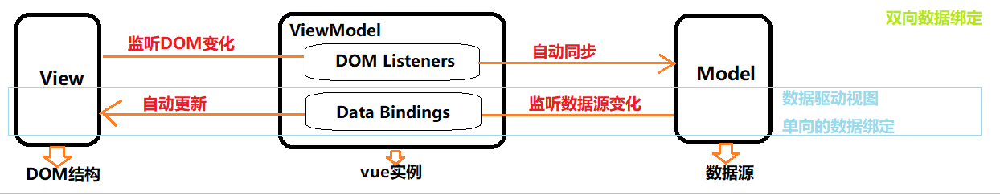
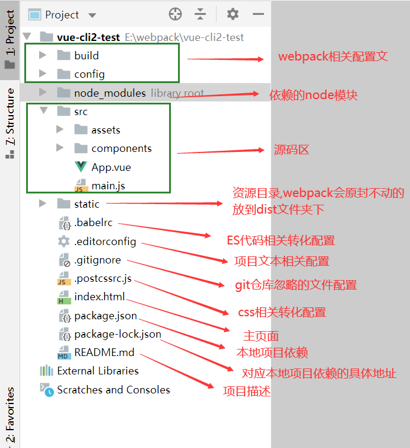

# VUE简介

Vue是一套用于构建用户界面的渐进式框架。

特点：

1. 遵循 MVVM 模式，借鉴 angular 的模板和数据绑定技术，借鉴 react 的组件化和虚拟 DOM 技术。
2. 适合 移动/PC 开发，代码简洁，体积小，运行效率高。
3. 它本身只关注 UI，可以轻松引入 vue 插件或其它第三库开发项目。

## 特性：

vue两大特性: 数据驱动视图，双向数据绑定

### (1)数据驱动视图

- 数据变化会驱动视图自动更新,当数据发生变化时,vue会监听数据变化,从而自动重新渲染页面结构(无须手动操作DOM)
- 单向的数据绑定(数据变化导致页面变化) 

### (2)双向数据绑定

- 在填写表单时,双向数据绑定可以辅助开发者在不操作DOM 的前提下,自动把用户填写的内容同步到数据源中
- js数据发生变化,会自动渲染到页面上; 页面表单数据发生变化时,被vue自动获取并更新到js中

## MVVM

- MVVM是vue实现数据驱动视图和双向数据绑定的核心原理(底层)
- MVVM指Model(数据源),View(DOM结构)和ViewModel(vue实例)
- 它把每个HTML页面都拆分成了这三个部分 (Model表当前页面渲染时所依赖的数据源, View表示当前页面所渲染的DOM结构, ViewModel表vue的实例,它是MVVM的核心)
- 当数据源发生变化时,会被ViewModel监听到,并自动重新渲染页面结构
- 当表单元素的值发生变化时,也会被VM 监听到并把变化后最新的值自动同步到Model数据源中



## 基本使用步骤

- 导入 vue.js 的 script 脚本文件
- 在页面中声明一个将要被 vue 所控制的 DOM 区域
- 创建 vm 实例对象（vue 实例对象）

```js
<body>
    <!-- view区域 -->
    <!-- ==================================== -->
    <!-- 2.使用vue控制该div，填充数据 -->
    <div class="box">{{ username }}</div>
    <!-- ==================================== -->
    <!-- 1.导入vue库文件，在window全局就有了Vue构造函数 -->
    <script src="./lib/vue-2.6.12.js"></script>
    <script>
        // new vue构造函数得到的实例对象就是 ViewModel
        // ==================================
        // 3.创建vue实例
        const vm = new Vue({
            el: '.box',   //el指向的选择器就是View的视图区域
            data: {       //data指向的对象就是Model数据源
                username: 'ys'
            }
        })
        // ==================================
    </script>
</body>
```

# VUE基础

## 插值表达式Mustache

- `{ {} }`，只是内容占位符，不覆盖原内容
- 只能用在元素内容节点,不能用在属性节点  `<p>性别:{{ sex }}</p>` 
- 不能识别标签

## 指令

指令(Directives)是vue为开发者提供的模板语法,用于辅助开发者渲染页面的基本结构,vue 中的指令按照不同的用途可以分为6 大类

### 参数

一些指令能够接收一个“参数”，在指令名称之后以冒号表示。

eg：(在这里参数是监听的事件名)

```html
<a v-on:click = "doSomething">...</a>
```

**动态参数**

从 2.6.0 开始，可以用方括号括起来的 JavaScript 表达式作为一个指令的参数

```html
<!-- 注意，参数表达式的写法存在一些约束 -->
<a v-bind:[attributeName]="url"> ... </a>
```

这里的 `attributeName` 会被作为一个 JavaScript 表达式进行动态求值，求得的值将会作为最终的参数来使用，例如，如果你的 Vue 实例有一个 `data` property `attributeName`，其值为 `"href"`，那么这个绑定将等价于 `v-bind:href`。

同样地，也可以使用动态参数为一个动态的事件名绑定处理函数：

```html
<a v-on:[eventName]="doSomething"> ... </a>
```

### 1.内容渲染指令

- v-text: 会覆盖元素默认内容 <p v-text="username"></p>
- v-html : 渲染带标签的内容,并实现标签样式,会覆盖元素默认内容 <div v-html="属性"></div>
- v-once：元素和组件只渲染一次，不会随着数据的改变而改变
- v-pre：用于跳过这个元素和它子元素的编译过程，一般我们的mustache语法会去data里面找对应的变量然后解析，可是如果我们就想让其显示为 `{{message}}` ，这个时候需要加 `v-pre` 属性
- v-cloak：我们data里面的数据可能是从服务器端获取来的，如果网络不好获取的比较慢，浏览器可能会直接显示出未编译的Mustache标签,我们可以给标签添加 v-cloak 来避免这种效果:
  - 加上v-clock 属性,并加上css。
  - vue解析之前有 v-clock 属性时，让其不显示
  - Vue解析之后没有v-clock 属性，再让其显示

### 2.属性绑定指令

- v-bind: (简写英文 :): 为元素的属性动态绑定属性值, 单向绑定(数据源影响DOM变)
- 支持绑定简单的数据值 
- 支持绑定js表达式的运算 <div :title=" 'box-' + index">div盒子</div> 字符串需加' '

### 3.事件绑定指令

- v-on:(简写@): 为DOM元素绑定事件监听 

- 处理函数写在实例对象的methods属性下 <button @click="add()">点击</button> ()可传参

- 原生DOM对象onclick,oninput,onkeyup等原生事件,替换为@click,@input,@keyup

  **事件对象$event**

  vue 提供的特殊变量,表原生的事件参数对象event, 在DOM事件的[回调函数](https://so.csdn.net/so/search?q=回调函数&spm=1001.2101.3001.7020)中传入参数`$event`，可以获取到该事件的事件对象

  可解决事件参数对象event被覆盖的问题，如果默认的事件对象e被覆盖了，则可以手动传递一个$event

  还可以在子组件中通过`$emit`注册事件，将数据作为参数传入，在父组件中通过`$event`接收

  **事件修饰符**

  | 事件修饰符 | 说明                                                         |
  | ---------- | ------------------------------------------------------------ |
  | stop       | 阻止了事件冒泡，相当于调用了event.stopPropagation方法        |
  | prevent    | 阻止了事件的默认行为，相当于调用了event.preventDefault方法   |
  | self       | 只当在 event.target 是当前元素自身时触发处理函数             |
  | once       | 绑定了事件以后只能触发一次，第二次就不会触发                 |
  | capture    | 使事件触发从包含这个元素的顶层开始往下触发                   |
  | passive    | 在移动端，当我们在监听元素滚动事件的时候，会一直触发onscroll事件会让我们的网页变卡，因此我们使用这个修饰符的时候，相当于给onscroll事件整了一个.lazy修饰符 (passive 和 .prevent 一起使用， .prevent 将会被忽略，同时浏览器可能会向你展示一个警告。) |
  | native     | 让组件变成像html内置标签那样监听根元素的原生事件，否则组件上使用 v-on 只会监听自定义事件 |
  
  **鼠标按键修饰符**
  
  鼠标按钮修饰符针对的就是左键、右键、中键点击，有如下：
  
  left 左键点击
  right 右键点击
  middle 中键点击
  
  ```html
  <button @click.left=“shout(1)”>ok</button>
  <button @click.right=“shout(1)”>ok</button>
  <button @click.middle=“shout(1)”>ok</button>
  ```
  
  **键盘修饰符**
  
  键盘修饰符是用来修饰键盘事件（onkeyup，onkeydown）的
  
  普通键（enter、tab、delete、space、esc、up…）
  系统修饰键（ctrl、alt、meta、shift…）
  
  只有按键为keyCode的时候才触发
  
  ```html
  <input type="text" @keyup.keyCode="shout()">
  <!-- 还可以通过以下方式自定义一些全局的键盘码别名 -->
  <!-- Vue.config.keyCodes.f2 = 113 -->
  ```
  

### 4.双向绑定指令

v-model：双向数据绑定指令，不操作DOM的前提下，快速获取表单的数据

> v-model指令只能配合表单元素一起使用。

为了方便对用户输入的内容处理，VUE为v-model提供了三个修饰符

| 修饰符  | 作用                           | 示例                             |
| ------- | ------------------------------ | -------------------------------- |
| .number | 自动将用户的输入值转为数值类型 | `<input v-model.number="age" />` |
| .trim   | 自动过滤用户输入的首尾空白字符 | `<input v-model.trim="msg" />`   |
| .lazy   | 在“change”时而非“input”时更新  | `<input v-model.lazy="msg" />`   |

### 5.条件渲染指令

按需控制 DOM 的显示与隐藏

- v-if: 动态创建或移出实现元素显示与隐藏, 有更高的切换开销,在运行时条件很少改变,使用较好( 刚进入页面时,某些元素默认不需要被展示,后期也不需展示 )
- v-else 必须配合v-if指令一起使用,否则不会被识别
- v-else-if 必须配合v-if指令一起使用,否则不会被识别
- v-show: 动态为元素添加或移除 style="display: none;" 样式实现显示与隐藏, 有更高的初始渲染开销, 需要非常频繁地切换,使用较好

template元素

因为v-if是一个指令，所以必须将其添加到一个元素上，当想要切换的是多个元素的时候，此时并不希望div被渲染，这是可以使用template，它可以当做一个不可见的包裹元素，最终template不会被渲染出来。

### 6.列表渲染指令

vue 提供了 v-for 指令，用来辅助开发者基于一个数组来循环渲染相似的 UI 结构。 v-for 指令需要使用item in list 的特殊语法，其中：

> list 是待循环的数组
> item 是当前的循环项

支持一个可选的第二个参数，即当前项的索引;

用索引时`(item, index) in list` , item项和index 索引都是形参,可重命名

**使用key维护列表状态**

当列表的数据变化时，默认情况下，vue 会尽可能的复用已存在的 DOM 元素，从而提升渲染的性能。但这种默认的性能优化策略，会导致有状态的列表无法被正确更新。

为了给 vue 一个提示，以便它能跟踪每个节点的身份，从而在保证有状态的列表被正确更新的前提下，提升渲染的性能。此时，需要为每项提供一个唯一的 key 属性

注意事项：

① key 的值只能是字符串或数字类型
② key 的值必须具有唯一性（即：key 的值不能重复）
③ 建议把数据项 id 属性的值作为 key 的值（因为 id 属性的值具有唯一性）
④ 使用 index 的值当作 key 的值没有任何意义（因为 index 的值不具有唯一性）
⑤ 建议使用 v-for 指令时一定要指定 key 的值（既提升性能、又防止列表状态紊乱）

## 过滤器

 过滤器（`filter`），**是对要显示的数据进行特定格式化后再显示（适用于一些简单逻辑的处理）**，就是把一些不必要的东西过滤掉。过滤器实质不改变原始数据，只是对数据进行加工处理后返回过滤后的数据再进行调用处理，我们也可以理解其为一个纯函数。

注：**`Vue3`中已废弃`filter`**

` vue`中的过滤器可以用在两个地方：**双花括号插值**和 **`v-bind` 表达式(:)**，过滤器应该被添加在 `JavaScript`表达式的尾部，由“管道”符号指示.。

使用过滤器：`{{ xxx | 过滤器名 }}`  或  `v-bind:属性 = "xxx | 过滤器名"`

在**组件的选项中**定义本地的过滤器（**局部过滤器**）：

```js
filters:{
	capitalize: function(value) {
		if(!value) return ''
        value = value.toString()
        return value.charAt(0).toUpperCase() + value.slice(1)
    }
}
```

定义全局过滤器：

```js
Vue.filter('capitalize', function(value){
    if(!value) return ''
    value = value.toString()
    return value.charAt(0).toUppercase() + value.slice(1)
})

new Vue({
    //...
})
```

> 当全局过滤器和局部过滤器重名时，会采用局部过滤器

 过滤器函数总接收表达式的值 (之前的操作链的结果) 作为第一个参数。

过滤器可以串联

`{{message | filterA | filterB}}`

 **在这个例子中，filterA 被定义为接收单个参数的过滤器函数，表达式 message 的值将作为参数传入到函数中。然后继续调用同样被定义为接收单个参数的过滤器函数 filterB，将 filterA 的结果传递到 filterB 中。**

过滤器是 JavaScript函数，因此可以接收参数：

`{{message | fliterA('arg1',arg2)}}`

**这里，`filterA` 被定义为接收三个参数的过滤器函数。**

**其中 `message` 的值作为第一个参数，普通字符串 `'arg1'` 作为第二个参数，表达式 `arg2` 的值作为第三个参数**

## 侦听器

侦听器就是用来侦听数据有没有变化，一旦有变化就调用函数

> 侦听器本质上是一个函数，如果要监听哪一个数据的变化，就把那个数据作为函数名

### 方法格式的侦听器：

语法：在和data、methods这些平级的位置写一个watch

```js
watch:{
    //参数1：改变后的值
    //参数2：改变前的值
    watchObject(newValue,oldValue){
        //侦听到数据变化之后，需要完成的行为
        console.log()
    }
}

```

- watchObject:监听对象 —— data中的属性（Number / String / Boolean / Array）
  - newValue:(非必须)  —— 改变后的新值
  - oldValue:(非必须) —— 改变前的值

方法格式的监听器有**两个缺点**：

1）首次进入浏览器的时候，无法立即触发一次侦听器

2）如果侦听的是一个**对象**，对象里面的数据发生了**变化**，并不会出发侦听器

**数组是引用类型,存在比较复杂的侦听规则。**

Vue不能检测以下数组的变动:

  a.当你利用索引值直接设置一个数组时,例如:vm.items[indexOfItem] = newValue

  b.当你修改数组的长度时,例如:vm.items.length = newLength

修改一个数组的内容,不会修改数组本身的地址。为此,Vue.js对数组做了特殊处理,使得使用*标准的数组操作方法*对数组所做的修改,都可以被侦听到。

> Vue将被侦听的数组的变更方法进行了包裹,所以它们也将会触发视图更新

如果直接修改数组的元素无法被侦听到  解决方法：使用$set()方法修改元素的值。

当我们想让一个新字段是响应式的，就使用this.$set()来注入数据，这个方法接收三个参数：

| 参数       | 描述                                            |
| ---------- | ----------------------------------------------- |
| target     | 可以是数组或者对象,是准备添加属性的对象或者数组 |
| name/index | 准备添加的属性的属性名或数字的索引              |
| value      | 准备添加的属性的值或者数组索引的值              |

### 对象格式的侦听器

```js
watch:{
	watchObject:{
    	handler:function(newVal,oldVal){
         	// something...
    },
    deep:true,
    immediate:true
}
```

- watchObject: 监听对象 —— data中的属性（Number / String / Boolean / Array / **Object**）
  - handler —— 回调函数(这里必须使用`handler`关键字，不能为自定义函数名。)
    - newValue(非必须)  —— 改变后的新值
    - oldValue(非必须) —— 改变前的值
  - deep(非必须) —— 是否开启深度监听
  - immediate(非必须) —— 是否在数据绑定阶段也执行handler函数

这一次监听对象列表里新添了`Object`对象，就是说之前的方法形式不能用来监听对象内部属性。因为`deep`属性默认为`false`，需要我们使用完整写法来手动开启深度监听。

**深度监听**：

- Vue 中的 watch 默认不监测对象内部值的改变（一层）
- 配置 deep: true 可以检测对象内部值的改变（多层）

**immediate 选项**：

- 默认值为 false，第一次进入页面不触发侦听器
- 当选项值设为 true 时，第一次进入页面就会触发侦听器

## 计算属性

计算属性指的是通过一系列运算之后,最终得到一个属性值, 写在computed节点下

语法：

```js
computed: {
    "计算属性名" () {
        return "值"
    }
}
```

> **函数内变量变化, 会自动重新计算结果返回**

vue计算属性是基于他们的依赖项的值结果进行缓存的，依赖不变都直接从缓存取结果

**总结：**计算属性带缓存，依赖项不变，都直接从缓存取，依赖项改变函数自动执行并重新缓存。当变量值依赖其他变量计算而来才用。

## VUE-CLI

如果你只是简单写几个Vue的Demo程序, 那么你不需要Vue CLI;如果你在开发大型项目, 那么你需要, 并且必然需要使用Vue CLI使用Vue.js开发大型应用时，我们需要考虑代码目录结构、项目结构和部署、热加载、代码单元测试等事情。如果每个项目都要手动完成这些工作，那无以效率比较低效，所以通常我们会使用一些脚手架工具来帮助完成这些事情。用vue.js开发大型应用需要使用webpack打包工具

**什么是CLI？**

1. CLI是Command-Line Interface, 翻译为命令行界面, 但是俗称脚手架
2. Vue CLI是一个官方发布 vue.js 项目脚手架
3. 使用 vue-cli 可以快速搭建Vue开发环境以及对应的webpack配置.

VUE的安装详见官网[vue-cli](https://cli.vuejs.org/zh/guide/installation.html)

vue-cli 2



## VUE生命周期

### 生命周期钩子

每个 Vue 实例在被创建时都要经过一系列的初始化过程——例如，需要设置数据监听、编译模板、将实例挂载到 DOM 并在数据变化时更新 DOM 等。同时在这个过程中也会运行一些叫做**生命周期钩子**的函数，这给了用户在不同阶段添加自己的代码的机会。