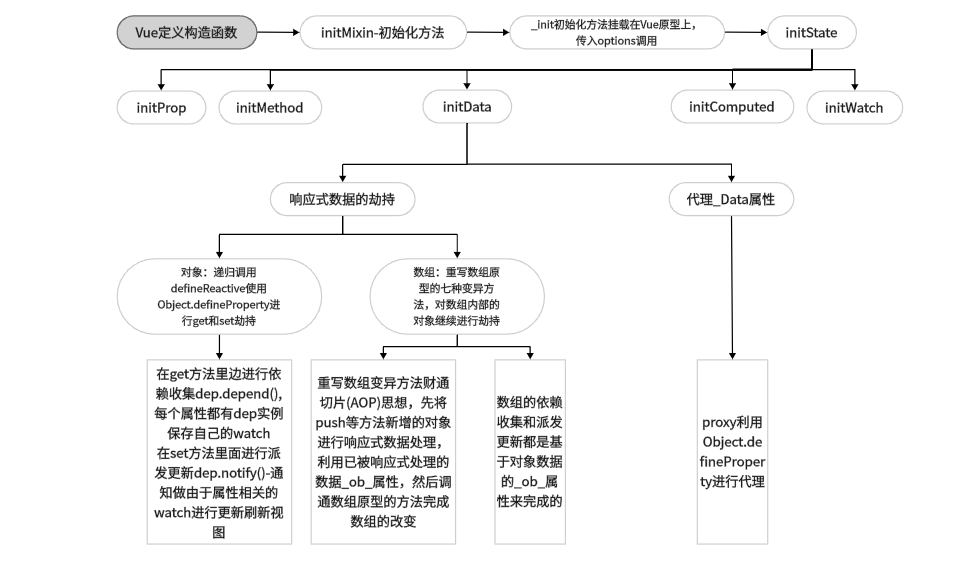

# 响应式原理
> 响应式数据思维导图：
> 

## 1.数据初始化

实例化Vue，Vue其实是一个构造函数，传入的参数是一个对象，称作options（选项）

```js
new Vue({
    el: "#app",
    router,
    store,
    render: (h) => h(App)
});
```

Vue 初始化可能会处理很多事情，所以划分不同文件引入利于代码分割

```js
// src/index.js

import { initMixin } from "./init.js";
// Vue就是一个构造函数 通过new关键字进行实例化
function Vue(options) {
  // 开始进行Vue初始化工作
  this._init(options);
}
// _init方法是挂载在Vue原型的方法 通过引入文件的方式进行原型挂载需要传入Vue
// 此做法有利于代码分割
initMixin(Vue);
export default Vue;
```

initMixin 把_init 方法挂载在 Vue 原型 供 Vue 实例调用

```js
// src/init.js

import { initState } from "./state";
export function initMixin(Vue) {
  Vue.prototype._init = function (options) {
    const vm = this;
    // 这里的this代表调用_init方法的对象(实例对象)
    //  this.$options就是用户new Vue的时候传入的属性
    vm.$options = options;
    // 初始化状态
    initState(vm);
  };
}
```

initData 里面的 observe 是响应式数据核心，所以另建 observer 文件夹来专注响应式逻辑 

```js
// src/state.js

import { observe } from "./observer/index.js";

/* 初始化状态 注意这里的顺序顺序依次是 prop>methods>data>computed>watch*/
export function initState(vm) {
  // 获取传入的数据对象
  const opts = vm.$options;
  if (opts.props) {
    initProps(vm);
  }
  if (opts.methods) {
    initMethod(vm);
  }
  if (opts.data) {
    // 初始化data
    initData(vm);
  }
  if (opts.computed) {
    initComputed(vm);
  }
  if (opts.watch) {
    initWatch(vm);
  }
}

// 初始化data数据
function initData(vm) {
  let data = vm.$options.data;
  //   实例的_data属性就是传入的data
  // vue组件data推荐使用函数 防止数据在组件之间共享
  data = vm._data = typeof data === "function" ? data.call(vm) : data || {};

  // 把data数据代理到vm 也就是Vue实例上面 我们可以使用this.a来访问this._data.a
  for (let key in data) {
    proxy(vm, `_data`, key);
  }
  // 对数据进行观测 --响应式数据核心
  observe(data);
}
// 数据代理
function proxy(object, sourceKey, key) {
  Object.defineProperty(object, key, {
    get() {
      return object[sourceKey][key];
    },
    set(newValue) {
      object[sourceKey][key] = newValue;
    },
  });
}
```

## 2.对象数据的劫持

什么是劫持？我们先为obj定义一个a属性：

```js
const obj = {}

let val = 1
Object.defineProperty(obj, a, {
  get() { 
    console.log('get property a')
    return val
  },
  set(newVal) {
    if (val === newVal) return
    console.log(`set property a -> ${newVal}`)
    val = newVal
  }
})
```

当我们访问`obj.a`时，打印`get property a`并返回1，`obj.a = 2`设置新的值时，打印`set property a -> 2`。这相当于我们自定义了`obj.a`取值和赋值的行为，使用自定义的`getter`和`setter`来重写了原有的行为，这也就是`数据劫持`的含义。

当obj有多个属性时，我们可以建一个`Observer`遍历该对象

```js
class Observer {
  constructor(value) {
    this.value = value
    this.walk()
  }
  walk() {
    Object.keys(this.value).forEach((key) => defineReactive(this.value, key))
  }
}
const obj = { a: 1, b: 2 }
new Observer(obj)
```

obj内有嵌套属性，使用递归来完成嵌套属性的数据劫持

```js
// 入口函数
function observe(data) {
  if (typeof data !== 'object') return
  // 调用Observer
  new Observer(data)
}

class Observer {
  constructor(value) {
    this.value = value
    this.walk()
  }
  walk() {
    // 遍历该对象，并进行数据劫持
    Object.keys(this.value).forEach((key) => defineReactive(this.value, key))
  }
}
// 需要一个全局变量来保存这个属性的值
// value使用了参数默认值
function defineReactive(data, key, value) {
  // 如果value是对象，递归调用observe来监测该对象
  // 如果value不是对象，observe函数会直接返回
  observe(value)
  Object.defineProperty(data, key, {
    get: function reactiveGetter() {
      return value
    },
    set: function reactiveSetter(newValue) {
      if (newValue === value) return
      value = newValue
      observe(newValue) // 设置的新值也要被监听
    }
  })
}

const obj = {
  a: 1,
  b: {
    c: 2
  }
}

observe(obj)
```

数据劫持核心是 defineReactive 函数 主要使用 Object.defineProperty 来对数据 get 和 set 进行劫持 这里就解决了之前的问题 为啥数据变动了会自动更新视图 我们可以在 set 里面去通知视图更新

> 这样递归的方式其实无论是对象还是数组都进行了观测 此时如果 data 包含数组比如 a:[1,2,3,4,5] 那么我们根据下标可以直接修改数据也能触发 set 但是如果一个数组里面有上千上万个元素 每一个元素下标都添加 get 和 set 方法 这样对于性能来说是承担不起的 所以此方法只用来劫持对象，且*对象新增或者删除的属性无法被 set 监听到 只有对象本身存在的属性修改才会被劫持*

```js
// src/obserber/index.js
class Observer {
  constructor(value) {
    this.value = value
    this.walk()
  }
  walk() {
    // 遍历该对象，并进行数据劫持
    Object.keys(this.value).forEach((key) => defineReactive(this.value, key))
  }
}
// Object.defineProperty数据劫持核心 兼容性在ie9以及以上
function defineReactive(data, key, value) {
  observe(value); // 递归关键
  // --如果value还是一个对象会继续走一遍odefineReactive 层层遍历一直到value不是对象才停止
  //   思考？如果Vue数据嵌套层级过深 >>性能会受影响
  Object.defineProperty(data, key, {
    get() {
      console.log("获取值");
      return value;
    },
    set(newValue) {
      if (newValue === value) return;
      value = newValue;
    },
  });
}
export function observe(value) {
  // 如果传过来的是对象或者数组 进行属性劫持
  if (Object.prototype.toString.call(value) === "[object 			Object]" || Array.isArray(value)){
    return new Observer(value);
  }
}
```

## 3.数组的观测

```js
// src/obserber/array.js

const methods = [
  "push",
  "pop",
  "shift",
  "unshift",
  "sort",
  "splice",
  "reverse",
];

// 保留获取数组原型方法
const oldArrMethods = Array.prototype;
// 根据数据原型上的方法全部拷贝
//这里是面向切片编程思想（AOP）--不破坏封装的前提下，动态的扩展功能
export const arrMethods = Object.create(oldArrMethods);

/**
 * 遍历需要处理的7个方法
 */
methods.forEach((method) => {
  // 劫持7个函数
  arrMethods[method] = function (...args) {
    // 获调用数据原有的方法
    const res = oldArrMethods[method].apply(this, args);

    // 若是调用 push、unshift和splice， 则inserted代表被加入的新的数据
    let inserted;
     // this代表的就是数据本身
    // 获取到Observer实例
    let ob = this.__ob__;

    switch (method) {
      case "push":
      case "unshift":
        inserted = args;
        break;

      case "splice": // splice 有新增 删除的功能，
        inserted = args.slice(2); // 截取 新增的数据
        break;
      default:
        break;
    }

    if (inserted) {
      // 将新增属性 继续劫持
      ob.observeArray(inserted);
    }
    
    return res;
  };
});
```


因为对数组下标的拦截太浪费性能 对 Observer 构造函数传入的数据参数增加了数组的判断

obserber整体变为：

```js
// src/obserber/index.js

import { arrayMethods } from "./array";
class Observer {
  constructor(value) {
    def(data, "__ob__", this);
    if (Array.isArray(value)) {
      // 这里对数组做了额外判断
      // 通过重写数组原型方法来对数组的七种方法进行拦截
      value.__proto__ = arrayMethods;
      // 如果数组里面还包含数组 需要递归判断
      this.observeArray(value);
    }
    this.value = value
    this.walk()
  }
  walk() {
    // 遍历该对象，并进行数据劫持
    Object.keys(this.value).forEach((key) => defineReactive(this.value, key))
  }
}

observeArray(items) {
    for (let i = 0; i < items.length; i++) {
      observe(items[i]);
    }
  }

// Object.defineProperty数据劫持核心 兼容性在ie9以及以上
function defineReactive(data, key, value) {
  observe(value); // 递归关键
  // --如果value还是一个对象会继续走一遍odefineReactive 层层遍历一直到value不是对象才停止
  //   思考？如果Vue数据嵌套层级过深 >>性能会受影响
  Object.defineProperty(data, key, {
    get() {
      console.log("获取值");
      return value;
    },
    set(newValue) {
      if (newValue === value) return;
      value = newValue;
    },
  });
}
//将数据设置为不可枚举，不可配置
export function def(data, key, value) {
  Object.defineProperty(data, key, {
    enumerable: false,
    configurable: false,
    value,
  });
}
export function observe(value) {
  // 如果传过来的是对象或者数组 进行属性劫持
  if (Object.prototype.toString.call(value) === "[object 			Object]" || Array.isArray(value)){
    return new Observer(value);
  }
}
```

以上功能只是对数据实现了响应式观测，但对数据修改后如何重新渲染需要结合Watcher和dep采用观察者模式实现依赖收集和派发更新

